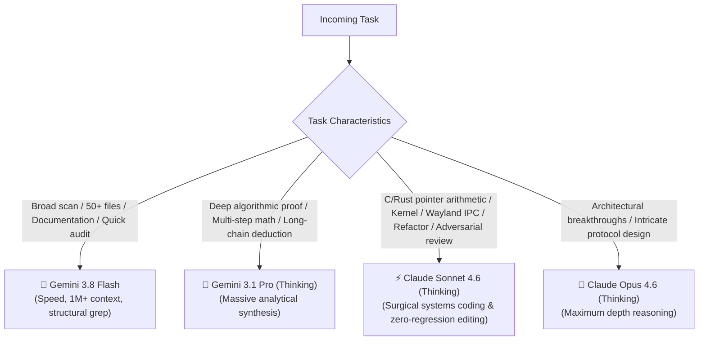
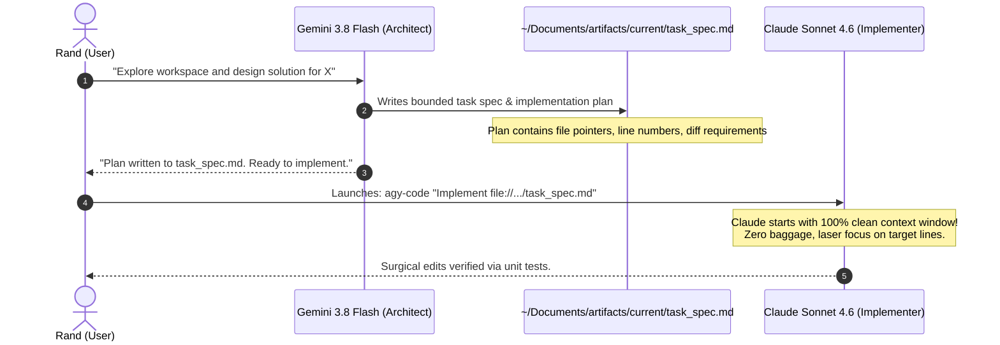

# Architectural Plan: Zero-Token Antigravity Suite Updates & Claude Synergy (v2)

## 1. Problem Statement & User Feedback Integration

This plan resolves two intertwined challenges:
1. **Automating Antigravity Suite Updates (CLI & IDE)** without incurring token bloat or command failure risks.
2. **Maximizing Claude Models in the AGY Suite** through clear model specialization scenarios, clean context-sharing protocols (without transcript bloat), and concrete terminal workflows.

---

## 2. Model Specialization Matrix: When to Use Which Model

Based on benchmark characteristics, reasoning architectures, and practical systems development:

### Concrete Scenarios & Routing Playbook



| Scenario / Task Type | Recommended Model | Why this Model Excels | Example Prompt / Trigger |
| :--- | :--- | :--- | :--- |
| **1. Suckless C & Desktop Plumbing** | **`claude-sonnet-4-6`** | Flawless C pointer logic, X11 coordinate handling, memory bounds, and avoiding off-by-one errors in `dwm.c`/`drw.c`. | `"Fix layout cycle arithmetic and handle nmaster decrements in dwm.c"` |
| **2. Adversarial Code Review** | **`claude-sonnet-4-6`** | Highly skeptical auditor. Catches unquoted bash variables, subtle race conditions, and signal leaks that Gemini glides over. | `"Review scripts/dwm-app-install for subshell leaks and POSIX edge cases"` |
| **3. High-Context Codebase Auditing** | **`gemini-3.8-flash-high`** | Massive 1M+ token context window. Ingests 40 files across 3 repositories in sub-seconds for cross-system dependency mapping. | `"Scan ~/dotfiles and ~/dwm-oomaya to list every script invoking dmenu"` |
| **4. Architectural Brainstorming & Planning** | **`gemini-3.8-flash-high`** | Fast, high-agency planning mode. Generates structured markdown blueprints without latency stalls. | `"/plan design a multi-machine artifact synchronization daemon"` |
| **5. Deep Theoretical Synthesis** | **`gemini-3.1-pro-high`** | Deep reasoning over massive document troves, synthesizing competing architecture patterns across months of transcripts. | `"Synthesize all historical post-mortems in ~/Vault into a 10-point systems law"` |
| **6. Multi-File Refactoring / Codemods** | **`claude-sonnet-4-6`** | Surgical diff precision. Preserves comments, respects existing conventions, and ensures zero broken references. | `"Refactor all notification calls across 6 bash scripts to use omarchy-notify"` |
| **7. Quota Failover (Anti-503 / 429)** | **`claude-sonnet-4-6`** | Seamless operational continuation when Google API endpoints encounter capacity spikes. | `agy -m claude-sonnet-4-6 -c` |

---

## 3. How Models Share Context Without Token-Bloat: The Artifact-Handoff Protocol

> [!IMPORTANT]
> **The Problem with Long Chat Transcripts**:
> Continuing a single conversation across dozens of turns accumulates massive transcript history (50,000+ tokens). This wastes tokens on repetitive context, triggers rate limits, and degrades model attention ("lost in the middle").

### The Solution: The Pristine Artifact-Handoff Protocol

Instead of dragging a bloated conversation history between models, models communicate asynchronously via **Structured Markdown Artifacts**:



### Why this is 10x More Efficient:
1. **Zero Transcript Bloat**: Claude begins execution with a pristine token budget, reading only the target plan and the relevant source files.
2. **Model Independence**: You can swap models at any boundary (Gemini plans $\rightarrow$ Claude codes $\rightarrow$ Claude audits $\rightarrow$ Gemini documents).
3. **Persistent Record**: The handoff artifact remains version-controlled in git (`~/antigravity-vault` or `.agents/artifacts/`).

---

## 4. Real-Life Terminal Scenarios: How `agy-code` Works

### Is `agy-code` Context-Aware?
**YES, fully context-aware.** When you run `agy` (or `agy-code`) from a terminal, the CLI engine automatically ingests:
1. **The Current Working Directory (`pwd`)**: Files in the current repo are instantly discoverable via the agent's internal file tools (`view_file`, `grep_search`, `list_dir`).
2. **Git State**: Active branch, staged/unstaged changes (`git status`), and recent commits.
3. **Active Rules & Customizations**: Reads `~/.gemini/config/GEMINI.md`, `~/.gemini/config/skills/` (e.g. `dwm-craft`, `omarchy`, `dotfiles-ops`), and project-local `.agents/`.
4. **Environment Variables**: Dynamically resolves `$HOME`, `$XDG_*`, and `$PATH`.

### Real-World Workflow Walkthroughs

#### Scenario A: Fixing a Wayland IPC Bug
```bash
# 1. Enter the project directory
cd ~/.config/hypr

# 2. Launch Claude with your specific intent
agy-code -i "omarchy-menu-windows fails to focus off-screen windows on the scrolling ribbon layout. Inspect hyprland.lua and fix the atomic dispatch."
```
- **What happens**: Claude loads `dotfiles-ops` and `omarchy` skills, searches `hyprland.lua`, spots the legacy `hyprctl dispatch` string, and applies the atomic Lua IPC dispatch (`hl.dispatch(hl.dsp.focus(...))`) with surgical precision.

#### Scenario B: Fixing a Crash in DWM
```bash
# 1. In dwm-oomaya
cd ~/dwm-oomaya

# 2. Launch Claude directly targeting the file and issue
agy-code "We are seeing a crash when pressing Super+D. Inspect keys[] in config.def.h and dwm.c line 1120."
```
- **What happens**: Claude opens `config.def.h`, detects the collision between `dmenu-desktop` and `incnmaster -1`, decouples the keymap, tests compilation via `make -j$(nproc)`, and reports the verified fix.

#### Scenario C: Resuming an Existing Session with Claude
```bash
# Continue the most recent session, switching model to Claude for coding:
agy --model claude-sonnet-4-6 -c
```

---

## 5. Part I: Zero-Token Automated Suite Updater (`agy-update`)

### Design & Defensive Guarantees
- **Location**: `scripts/agy-update` (in `dwm-oomaya`), stowed to `~/.local/bin/agy-update`.
- **Zero Token Cost**: Pure POSIX/Bash automation running locally in < 1 second.
- **Defensive Error Boundaries**:
  - Checks for `update-desktop-database` before running:
    ```bash
    if command -v update-desktop-database >/dev/null 2>&1; then
        update-desktop-database "$APP_DIR" >/dev/null 2>&1 || true
    fi
    ```
  - Graceful fallback if `agy` binary is not in `$PATH`.
  - Non-destructive tarball handling: keeps original archive safe until extraction is verified.

### Core Workflow of `agy-update`
1. **CLI Component**:
   - Runs `agy update`.
   - Checks if a new binary was installed; captures version change (`1.2.3 -> 1.2.4`).
2. **IDE Component**:
   - Checks `~/Downloads` for `Antigravity IDE*.tar.gz` (standard download path from `antigravity.google`).
   - Compares archive timestamp against installed binary in `~/.local/share/antigravity/antigravity-ide`.
   - If newer: invokes `app-install --user "$ARCHIVE" --name antigravity --title "Antigravity IDE"`.
   - If no archive is found: reports current version from `package.json` / `product.json`.
3. **Desktop Notification**:
   - If run interactively: prints clean terminal status summary.
   - If run via on-launch check: sends a non-intrusive desktop notification via `notify-send` only when an update was installed or an archive is waiting in `~/Downloads`.

---

## 6. Agent-Triad Skill Enhancement: Anti-Token-Fire Guardrails

Per user feedback, running 3 agents in an unconstrained loop can create a "token-fire." We will enhance `~/.gemini/config/skills/agent-triad/SKILL.md` with two mandatory architectural controls:

### 🛡️ Guardrail 1: Hard Round Limit (`MAX_ROUND_COUNT=2` — The 1-Revision Law)
- The dialogue loop between **Designer** and **Reviewer** is capped at strictly **2 rounds**:
  - **Round 1**: Designer presents architectural blueprint / patch $\rightarrow$ Reviewer critiques edge cases, literals, and test failures.
  - **Round 2**: Designer applies surgical revisions $\rightarrow$ Reviewer validates fixes.
- If full consensus is not reached after Round 2, the debate **immediately halts** and escalates to the **Human Tollgate (Rand)** with a clean diff of remaining disagreements.
- **Why Round Count 2 is Pareto-Optimal**: Allows exactly one rigorous revision cycle while preventing circular debate, bikeshedding, and token burn.

### 🛡️ Additional Pareto Improvements for `agy-update`:
1. **Running Process Protection (`ETXTBSY` Guard)**:
   - Uses atomic symlink swapping (`ln -sfn ...`) rather than overwriting files in-place, so an actively running Antigravity IDE session will never crash with `Text file busy`.
2. **Safe Rollback Buffer**:
   - Keeps the previous version staged as `~/.local/share/antigravity.bak` until the new binary verifies execution, allowing instant zero-downtime rollback if a downloaded tarball is corrupt.
3. **Quiet Mode for Daemon/Hook Checking (`--quiet` / `-q`)**:
   - Emits output only when a new version is actually detected or installed, making it ideal for non-blocking on-launch checks or cron schedules.

### 📄 Guardrail 2: Mandatory Consensus File Offload
- The final output of the Triad **must never be dumped into chat**.
- The Mediator automatically writes the finalized consensus into:
  `~/Documents/artifacts/current/triad_consensus.md` *(convenience mirror: `~/Documents/artifacts/current_plan.md`)*.
- The chat response outputs only:
  1. A 2-sentence executive summary.
  2. Direct link: `[current_plan.md](file:///home/rand/Documents/artifacts/current_plan.md)`.
  3. The specific questions requiring user sign-off.

---

## 7. Implementation Deliverables

1. **`scripts/agy-update`**:
   - Created in `~/dwm-oomaya/scripts/agy-update`.
   - Stowed in `~/dotfiles/omarchy/.local/bin/agy-update`.
   - Added to `~/dotfiles/verify.sh` health suite.
2. **Shell Ergonomics (`~/.bashrc` & `dotfiles`)**:
   - Add aliases:
     ```bash
     alias agy-code="agy --model claude-sonnet-4-6"
     alias agy-opus="agy --model claude-opus-4-6-thinking"
     alias agy-plan="agy --model gemini-3.8-flash-high --mode plan"
     ```
3. **Agent-Triad Skill Upgrade**:
   - Update `~/.gemini/config/skills/agent-triad/SKILL.md` with `MAX_ROUND_COUNT=3` and the mandatory consensus file output protocol.
4. **Systems Runbook**:
   - Document the update workflow and dual-model protocol in `docs/runbooks/antigravity_suite_and_model_synergy_guide.md` (mirrored to `~/vault/antigravity-artifacts/guides/`).

---

## 8. Verification Plan

1. **Script Validation**:
   - Run `shellcheck` and `bash -n` on `agy-update`.
   - Test `agy-update --check` on local machine.
2. **CLI Model Test**:
   - Test `agy-code -p "hello"` to verify Claude Sonnet 4.6 responds cleanly.
3. **Skill Verification**:
   - Verify `agent-triad` SKILL.md adheres to YAML frontmatter and contains the round limit rule.
