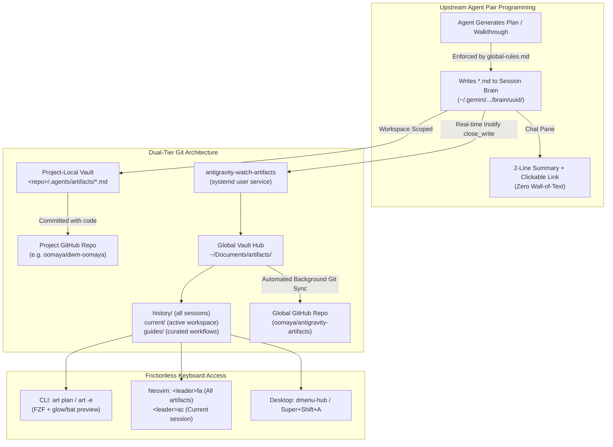

# Strategy & Implementation Plan: Dual-Tier GitHub Artifact Vault & Frictionless Access

This document establishes the architecture and execution plan to eliminate chat sidebar friction, enforce mandatory markdown offloading for long agent responses, and synchronize artifacts across projects and machines using a **Dual-Tier GitHub Vault Strategy**.

---

## 1. Goal Description & Problem Statement

### The Problem
1. **Sidebar Scroll Marathon**: In the Antigravity IDE and `agy` CLI, complex plans, audits, and walkthroughs dumped directly into the chat pane create vertical scrolling friction, especially on laptops and inside VMs.
2. **Ephemeral Brain Storage**: Antigravity writes session data into opaque UUID hashes (`~/.gemini/antigravity-cli/brain/<uuid>/`), decoupling valuable engineering plans from the project repositories they describe.
3. **Multi-Device Disconnect**: When switching between your main desktop rig, the LG Gram, and the Studio 1558, previous plans, walkthroughs, and transcripts are scattered across local disks rather than synced to a central Git-backed vault.

### The Solution
A unified, two-tier architecture codified directly in your `oomaya` dotfiles and `global-rules.md`:
- **Tier 1 (Upstream Enforcer)**: `global-rules.md` strictly forces the agent to offload long outputs (>20 lines) to `*.md` artifacts, keeping chat to a 2-line pointer.
- **Tier 2 (Project-Local Vault)**: Project-specific plans and walkthroughs live inside `<project-root>/.agents/artifacts/`, versioned and committed alongside project code in its own GitHub repo.
- **Tier 3 (Global Artifact Vault)**: A dedicated GitHub repository (`oomaya/antigravity-artifacts` or `~/Documents/artifacts`) backed by a background systemd user service (`antigravity-artifact-sync.service`) that captures all session history across all projects, browsable via `art` and Neovim `<leader>fa`.

---

## 2. Architecture: The Dual-Tier GitHub Vault Mesh



---

## 3. Approved Technical Decisions & Engineering Rails

> [!IMPORTANT]
> **Approved Global Vault Repository**:
> - Repository Name: **`oomaya/vault`** (Private under `@oomaya` organization).
> - Purpose: Central, cross-machine sync for all plans, walkthroughs, guides, and transcripts across desktop PC, LG Gram, and Studio 1558.

> [!NOTE]
> **Scope of Managed Deliverables**:
> The vault comprehensively captures and indexes:
> 1. **Implementation Plans** (`*_plan.md`): Architectural designs, tollgate milestones, and execution blueprints.
> 2. **Walkthroughs** (`walkthrough*.md`): Post-implementation verification, test evidence, and validation reports.
> 3. **Diagnostic Deliverables**: System crash analyses, kernel/hardware boundary notes, and deep triage runbooks.
> 4. **Curated Guides & Cheat Sheets** (`guides/`): Long-term reference materials, keymaps, and workflows.
> 5. **Distilled Transcripts & Session Indexes**: Traceability across past pairing sessions.

> [!CAUTION]
> **Clever Engineering Rails: Zero Memory Bloat & Repo Overload**:
> 1. **Zero Polling / Zero Idle CPU**: `antigravity-watch-artifacts` uses kernel `inotifywait` (`close_write`, `moved_to` on `*.md` only), sleeping at 0.0% CPU and negligible memory (<5 MB).
> 2. **Process Lock & Contention Guard**: `flock -n /run/user/$UID/antigravity-sync.lock` prevents overlapping sync processes during rapid edits.
> 3. **Strict Git Payload Hygiene**: Repository is strictly constrained to lightweight UTF-8 text (`*.md`, `.metadata.json`). Binary files, credentials, `.env`, and unredacted screenshots are strictly blocked by `.gitignore`.
> 4. **Strict Zero Privacy Invasion**: Media or captures are never synchronized to the vault unless explicitly confirmed, cropped to UI components, and fully redacted.


---

## 4. Proposed Changes & Implementation Strategy

 ग्रुपing implementation into two phases: **Phase 1 (Immediate Local Activation)** and **Phase 2 (GitHub Vault Mesh & Automation)**.

---

### Phase 1: Immediate Local Activation (The 4 Baseline Steps)

#### [MODIFY] `~/.gemini/antigravity-cli/global-rules.md`
Add **Section 6: The Scratchpad & Artifact Offload Law** to enforce:
1. Long responses (>20 lines) must never be dumped in chat.
2. Must write directly to a `*.md` artifact.
3. Chat response is strictly restricted to a 2–3 line summary + clickable `file://` link.
4. Auto-mirror project artifacts into `<project-root>/.agents/artifacts/`.

#### [NEW] `~/.local/bin/art`
Deploy the battle-tested interactive fuzzy viewer from `dotfiles/antigravity/.local/bin/art`:
- `art`: FZF fuzzy search across all artifacts with live preview.
- `art plan`: Instantly view the latest plan.
- `art -e plan`: Open the latest plan directly in Neovim (`$EDITOR`).
- `art -l`: List active session artifacts.

#### [NEW] `~/.local/bin/antigravity-sync-artifacts` & `~/.local/bin/antigravity-watch-artifacts`
Deploy the inotify synchronization scripts:
- `antigravity-sync-artifacts`: Syncs CLI and IDE brain directories into `~/Documents/artifacts/{current,history,guides}` and commits to git.
- `antigravity-watch-artifacts`: Real-time `inotifywait` daemon listening on `.md` close-write events.

#### [NEW] `~/.config/systemd/user/antigravity-artifact-sync.service`
Deploy the user systemd service and enable it:
```bash
systemctl --user daemon-reload
systemctl --user enable --now antigravity-artifact-sync.service
```

#### [MODIFY] `~/.config/nvim/lua/config/keymaps.lua` & `autocmds.lua`
Add the Snacks/Telescope keymaps from `dotfiles/nvim/`:
- `<leader>fa`: Search all AI artifacts in `~/Documents/artifacts/`.
- `<leader>ac`: Search current active session artifacts (`~/Documents/artifacts/current/`).
- `<leader>ag`: Search curated guides and cheat sheets (`~/Documents/artifacts/guides/`).
- Inotify buffer reload on external disk writes.

---

### Phase 2: Dual-Tier GitHub Repository Vault Strategy

#### 1. The Global Vault Repository (`oomaya/antigravity-artifacts`)
- Initialize `~/Documents/artifacts` as a Git repository.
- Connect remote to `git@github.com:oomaya/antigravity-artifacts.git` (created via `gh repo create oomaya/antigravity-artifacts --private`).
- Enhance `antigravity-sync-artifacts` to perform non-blocking, debounced background pushes (`git push -q origin main 2>/dev/null || true`) protected by `flock` to eliminate race conditions.
- On other machines (LG Gram, Studio 1558): cloning this repo to `~/Documents/artifacts` instantly gives full access to all historical plans and guides.

#### 2. Project-Local Vault Standard (`<project-root>/.agents/artifacts/`)
- For every project repository (e.g. `dwm-oomaya`, `dotfiles`, `antigravity-skills`):
  - Standardize `.agents/artifacts/` in the repository root.
  - Whenever the agent authors a plan or walkthrough, it places a copy into `.agents/artifacts/`.
  - When committing feature branches (e.g. `feat/oomaya-dwm-standalone`), the plan and walkthrough are committed **with the code**.
  - Reviewers, collaborators, and your future self can inspect `git log` and see the exact architectural reasoning alongside the C/Lua/Shell diff.

---

## 5. Verification Plan

### Automated Verification
1. **Daemon Verification**:
   ```bash
   systemctl --user is-active antigravity-artifact-sync.service
   journalctl --user -u antigravity-artifact-sync.service --no-pager -n 20
   ```
2. **Sync Assertion**:
   - Write a test `.md` artifact to the session brain.
   - Assert it immediately appears in `~/Documents/artifacts/current/` and is staged in Git within 1 second.
3. **CLI Browser Test**:
   ```bash
   art -l
   art --help
   ```
4. **Neovim Picker Test**:
   - Headless test of `keymaps.lua` using Neovim batch invocation to assert zero syntax or loading errors.

### Manual Verification
1. Hit `<leader>ac` inside Neovim $\rightarrow$ verify current session artifacts popup in Snacks picker.
2. Run `art plan` in terminal $\rightarrow$ verify latest plan renders cleanly with formatting.
3. Test a mock agent turn $\rightarrow$ verify agent produces only a 2-line summary and a markdown link, with no wall-of-text in chat.
