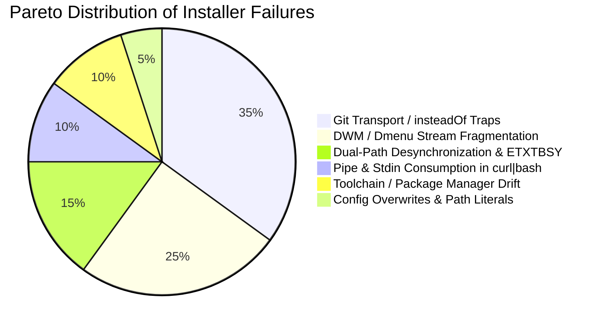
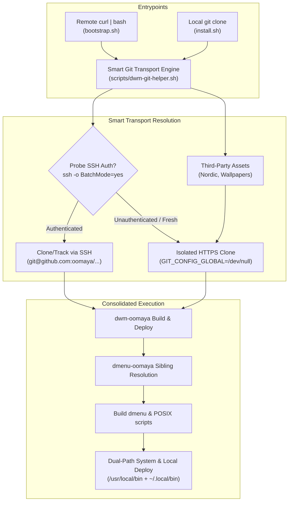

# Streamline DWM-oomaya & Dmenu Consolidated Installation Pipeline

Consolidate `dwm-oomaya` and `dmenu-oomaya` into a unified, zero-friction installation ecosystem, solve the Git `insteadOf` rewrite loop and SSH/HTTPS authentication trap, and provide an automated remote bootstrapper and local installer.

---

## 1. Architectural Diagnosis: The Dual Stream & `insteadOf` Dilemma

### A. The DWM / Dmenu Stream Fragmentation
Currently, `dwm-oomaya` and `dmenu-oomaya` exist as separate, decoupled repositories. While suckless modularity favors independent C source trees, user-facing desktop functionality is tightly coupled:
- Every key application launcher and window control hotkey in `dwm-oomaya/config.def.h` invokes custom `dmenu-oomaya` binaries and scripts:
  - `MODKEY + d` $\rightarrow$ `dmenu-desktop`
  - `Mod1Mask + p` $\rightarrow$ `dmenu-run`
  - `Mod1Mask + x` $\rightarrow$ `dmenu-power`
  - `Mod1Mask + Tab` $\rightarrow$ `dmenu-windows`
  - `MODKEY + Shift + h` $\rightarrow$ `dmenu-hub`
  - `MODKEY + Print` $\rightarrow$ `dmenu-scrot`
- In the current `install.sh`, `dmenu-oomaya` is **never cloned, built, or installed**.
- As a result, a user following `install.sh` gets a functional window manager where 50% of the primary navigation hotkeys fail silently without explanation.

### B. The `insteadOf` Git Trap & Rewrite Loop
Power users and developers frequently configure Git to route GitHub operations through SSH to avoid entering credentials:
```gitconfig
[url "git@github.com:"]
    insteadOf = https://github.com/
```
This causes three severe failure modes during installation:
1. **The Infinite Rewrite Loop**:
   If an installation script tries to ensure HTTPS by passing `-c url."https://github.com/".insteadOf="git@github.com:"`, Git encounters two opposing rewrite rules (`https://` $\rightarrow$ `git@` $\rightarrow$ `https://`) and aborts immediately:
   ```
   fatal: infinite loop in insteadOf substitution detected!
   ```
2. **The Missing SSH Key / Host Key Prompt Blackout**:
   When `insteadOf` forces SSH transport on a new machine, container, or VM before the user generates or adds their SSH public key to GitHub, running `git clone https://github.com/...` fails with `Permission denied (publickey)`. In unattended or piped environments (`curl ... | bash`), SSH cannot prompt for host key verification (`StrictHostKeyChecking`), causing silent or immediate termination.
3. **Third-Party Public Repository Failure**:
   The installer clones public themes and assets (`EliverLara/Nordic`, `ChrisTitusTech/nord-background`). Rewriting these public URLs to SSH (`git@github.com:...`) causes SSH to fail if the user's GitHub SSH key is scoped or if they are not authenticated.

---

## 2. Pareto-Principled Premortem (The 80/20 Failure Analysis)

To ensure this installation pipeline is indestructible across bare metal, VMs, and fresh distros, we evaluate the 20% of failure mechanisms responsible for 80% of installer failures:



### Premortem Failure Modes & Defensive Guardrails

| Failure Mode (The 20%) | Root Cause | Impact (The 80%) | Engineered Guardrail |
| :--- | :--- | :--- | :--- |
| **1. Git Transport / `insteadOf` Loop Trap** | Global `url.git@github.com:.insteadOf` rewrites HTTPS to SSH; naive inversion loops. | Total abort: `infinite loop` or `Permission denied (publickey)`. | **Git Config Isolation Shield**: Execute public/fallback clones with `GIT_CONFIG_GLOBAL=/dev/null GIT_CONFIG_SYSTEM=/dev/null GIT_CONFIG_NOSYSTEM=1`. Probe SSH non-interactively (`ssh -o BatchMode=yes -o StrictHostKeyChecking=accept-new -T git@github.com`); if authenticated, use SSH for `oomaya/*` repos; otherwise cleanly use HTTPS without triggering any `insteadOf` substitution. |
| **2. DWM/Dmenu Stream Divergence** | Separate repos built independently; dmenu missing from `install.sh`. | Silent hotkey blackout (`Super+d`, `Alt+p` do nothing). | **Consolidated Lockstep Build**: `install.sh` automatically discovers or clones `dmenu-oomaya` alongside `dwm-oomaya`, builds both, and deploys both to system (`/usr/local/bin`) and local (`~/.local/bin`). |
| **3. Dual-Path Drift & `ETXTBSY`** | Display managers use `/usr/local/bin/dwm`; live binary replaced via `cp` while running. | Crashed X session (`Text file busy`) or stale binary running after build. | **Inode-Safe Replacement**: Always use `install -Dm755` to safely unlink active inodes in memory; deploy to `/usr/local/bin` and `~/.local/bin` with checksum parity verification. |
| **4. Piped Stdin Consumption (`curl \| bash`)** | Running `curl ... \| bash` connects stdin to the curl stream instead of the terminal. | Prompts (`read -r`) consume the remaining bash script, crashing mid-run. | **TTY Preservation Engine**: Remote `bootstrap.sh` detects `! -t 0` and redirects interactive input from `/dev/tty` when interactive prompts are required. |
| **5. Distro Toolchain Gaps** | Incomplete build headers (`libX11-devel`, `xorgproto`, `gcc`, `make`). | `make` fails with missing headers. | **Pre-Flight Dependency Validation**: Validate package managers (`dnf`, `pacman`, `apt`) and install required toolchains before compilation targets execute. |
| **6. Destructive Overwrites** | Installer blindly overwriting user `config.h` or custom hotkeys. | Lost user configurations and custom keybinds. | **Preservation Law**: Never overwrite existing `config.h` or user TOML configuration; seed defaults only if files do not exist. |

---

## 3. Proposed Changes & Architecture

The solution consists of three coordinated layers:



---

### Component 1: Smart Git Transport Engine & Isolation Shield

#### [NEW] [scripts/dwm-git-helper.sh](file:///home/rand/dwm-oomaya/scripts/dwm-git-helper.sh)
A dedicated, reusable shell library providing:
- `dwm_git_probe_ssh()`: Non-interactive, sub-second probe testing GitHub SSH authentication:
  `ssh -o BatchMode=yes -o ConnectTimeout=3 -o StrictHostKeyChecking=accept-new -T git@github.com 2>&1`
- `dwm_git_clone()`: Intelligently selects protocol:
  - If user explicitly passes `--git-protocol=ssh` or `--git-protocol=https`, enforces selection.
  - If `--git-protocol=auto` (default):
    - For `oomaya/*` repos: uses SSH if `dwm_git_probe_ssh` passes; otherwise uses HTTPS with Isolation Shield.
    - For external/third-party repos (`Nordic`, wallpapers): **always** uses HTTPS with Isolation Shield (`GIT_CONFIG_GLOBAL=/dev/null GIT_CONFIG_SYSTEM=/dev/null GIT_CONFIG_NOSYSTEM=1`).
- `dwm_git_safe_clone()`: Guarantees zero `insteadOf` substitution cycles and zero public-key authentication prompts for anonymous public repos.

---

### Component 2: Consolidated Installer (`install.sh`)

#### [MODIFY] [install.sh](file:///home/rand/dwm-oomaya/install.sh)
Enhance `install.sh` to:
1. Source `scripts/dwm-git-helper.sh`.
2. Add options:
   - `--skip-dmenu`: Skip dmenu-oomaya installation (default: false, install dmenu).
   - `--dmenu-dir=PATH`: Explicit path to `dmenu-oomaya` source (default: autodiscover `../dmenu-oomaya`, `~/.local/src/dmenu-oomaya`, or clone).
   - `--git-protocol={auto,ssh,https}`: Control Git transport.
3. Replace hardcoded `git clone` calls:
   - Nordic GTK theme (`line 422`): use `dwm_git_safe_clone` with isolated HTTPS.
   - Nord wallpapers (`line 719`): use `dwm_git_safe_clone` with isolated HTTPS.
4. Add `install_dmenu_ecosystem()`:
   - Locate or clone `dmenu-oomaya` to `~/.local/src/dmenu-oomaya`.
   - Compile `dmenu` and `stest` with `make -j$(nproc)`.
   - Install system-wide via `sudo make install PREFIX=/usr/local` (installs `dmenu`, `stest`, `dmenu_path`, `dmenu_run`, and all `scripts/dmenu-*`).
   - Install user-local copy via `make install PREFIX="$HOME/.local"`.
   - Verify executable parity: ensure `dmenu-desktop`, `dmenu-run`, `dmenu-windows`, `dmenu-power`, `dmenu-hub`, `dmenu-scrot`, `dmenu-clip` are present and executable in both `/usr/local/bin` and `~/.local/bin`.

---

### Component 3: Remote Zero-Friction Bootstrapper

#### [NEW] [bootstrap.sh](file:///home/rand/dwm-oomaya/bootstrap.sh)
Single-command remote entrypoint for fresh machines:
```bash
curl -fsSL https://raw.githubusercontent.com/oomaya/dwm-oomaya/main/bootstrap.sh | bash
```
Features:
- **TTY Reattachment**: If stdin is piped (`! -t 0`), re-attaches stdin to `/dev/tty` so interactive prompts (`sudo`, profile selection) do not consume script instructions.
- **Dependency Bootstrap**: Checks for `git`, `curl`, and base packaging tools; installs them if missing.
- **Canonical Workspace Preparation**: Prepares `~/.local/src/dwm-oomaya` and `~/.local/src/dmenu-oomaya`.
- **Clones Repositories**: Uses Smart Git Transport to clone both repositories.
- **Executes Installer**: Invokes `~/.local/src/dwm-oomaya/install.sh "$@"`.

---

### Component 4: Makefile & Ecosystem Integration

#### [MODIFY] [Makefile](file:///home/rand/dwm-oomaya/Makefile)
- Add target `install-dmenu` that delegates to sibling `../dmenu-oomaya` or `~/.local/src/dmenu-oomaya` if present.
- Ensure `check-install` test validates dmenu integration.

#### [MODIFY] [README.md](file:///home/rand/dwm-oomaya/README.md)
- Update Quickstart to showcase the consolidated remote one-liner and local install commands.
- Document the Smart Git Transport (`--git-protocol` flags and `insteadOf` safety).

---

## 4. Verification & Testing Plan

### Automated Tests
1. **Smart Git Transport & `insteadOf` Immunity Test (`tests/test-smart-git.sh`)**:
   - Configure a mock temporary Git environment with `url."git@github.com:".insteadOf = "https://github.com/"`.
   - Run `dwm_git_safe_clone` against a public repository.
   - Verify that:
     1. No infinite loop occurs (`fatal: infinite loop in insteadOf substitution detected!`).
     2. No SSH authentication is attempted for anonymous HTTPS clones.
     3. The clone succeeds cleanly.
2. **Consolidated Installation Test (`tests/test-consolidated-install.sh`)**:
   - Run `install.sh --dry-run` to verify that `dmenu-oomaya` build and install steps are part of the resolved execution plan.
   - Run installation in a staging directory (`DESTDIR=...`) and verify all `dmenu-*` binaries are deployed.
3. **Existing Test Suite**:
   - Execute `make check-install` and `tests/test-install-preservation.sh` to ensure zero regression in user file preservation and system file symmetry.

### Manual Verification
1. Inspect checksums of deployed binaries:
   `sha256sum /usr/local/bin/dwm ~/.local/bin/dwm /usr/local/bin/dmenu ~/.local/bin/dmenu`
2. Test keybindings calling `dmenu-*` scripts in a nested/Xvfb X session to confirm zero keybinding blackout.

---

## 5. User Review & Tollgate Decisions

> [!IMPORTANT]
> **Canonical Source Directory**:
> The plan standardizes on `~/.local/src/dwm-oomaya` and `~/.local/src/dmenu-oomaya` as the canonical source directories for local builds and git tracking, while supporting adjacent sibling directories (`../dmenu-oomaya`) for developer multi-repo checkouts.

> [!NOTE]
> **Git Remote Protocol Behavior**:
> When an authenticated SSH session is detected (e.g., user `oomaya` on their development machine), the repositories will track via SSH (`git@github.com:oomaya/...`) so changes can be committed and pushed immediately. On machines without GitHub SSH keys, it falls back to isolated HTTPS with zero insteadOf interference.
