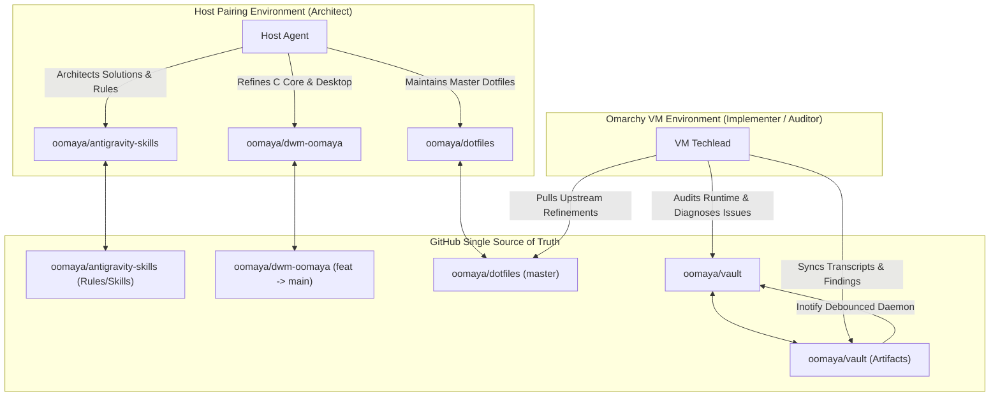

# Systemic Learning & Architectural Retrospective: Knowledge Vault & Desktop Federation

## Executive Summary

This project unified the desktop environment (`dwm-oomaya`), multi-machine dotfiles automation (`oomaya/dotfiles`), skills federation (`oomaya/antigravity-skills`), and a centralized cross-machine AI knowledge trove ([`oomaya/vault`](https://github.com/oomaya/vault)). 

Beyond solving immediate UI and keybinding requirements, the collaboration between the **Host Architect** and the **Omarchy VM Techlead** yielded critical architectural lessons in directory isolation, GNU Stow tree-folding hazards, POSIX symlink idempotency, and asynchronous multi-agent coordination.

---

## 1. Architectural Breakthroughs & Core Invariants

### A. The Decoupled Knowledge Vault Pattern (`~/antigravity-vault`)
- **The Problem**: Conflating user notes directories (`~/Vault`) with git-versioned AI artifacts caused synchronization conflicts, tool collision, and risk to personal data.
- **The Solution**: 
  - Dedicated master repository: `oomaya/vault` cloned strictly to `~/antigravity-vault` (`$HOME/antigravity-vault`).
  - Transparent backward-compatible bridge: `~/Documents/artifacts -> ~/antigravity-vault/antigravity-artifacts`.
  - Personal space isolation: `~/Vault` is quarantined and preserved strictly for personal notes, remaining clean of `.git` and AI session metadata.
- **Key Neovim Mapping Standard**:
  - `<leader>fv`: Find Antigravity Vault (`~/antigravity-vault`)
  - `<leader>fa`: Find AI Artifacts & Notes (`~/Documents/artifacts`)
  - `<leader>ac`: Current Session Artifacts (`current/`)
  - `<leader>ag`: Curated Guides & Cheat Sheets (`guides/`)

### B. Single Source of Truth vs. GNU Stow Collisions
- **The Problem**: Tracking `.gemini/config/GEMINI.md` and `.gemini/config/skills/` in both `oomaya/dotfiles` (stow package `antigravity`) and `oomaya/antigravity-skills` caused GNU Stow to abort with `existing target is not owned by stow`.
- **The Invariant**: A given configuration file or tree must have exactly **one authoritative owner**. 
  - Dotfiles should own tool launchers (`~/.local/bin/`), user environment configs, and terminal profiles.
  - `oomaya/antigravity-skills` exclusively owns global agent rules and skill definitions.
  - By pruning duplicate tracked config directories from `dotfiles/antigravity`, Stow runs cleanly without conflicts.

### C. POSIX Symlink Idempotency Trap (`ln -sf` vs. `ln -sfn`)
- **The Hazard**: When target directory `$HOME/.gemini/config/skills/agent-triad` is already a symlink pointing to `/path/to/skill`, running `ln -sf /path/to/skill $target` causes `ln` to resolve the symlink and create a nested self-referential symlink (`agent-triad/agent-triad -> agent-triad/`) inside the source repository.
- **The Failure Cascade**: Git detects files inside a directory that is a symlink and halts during `git pull` or `autostash` with `error: '<path>' is beyond a symbolic link`.
- **The Universal Fix**: Always use `ln -sfn` (or `ln -sfT` in GNU coreutils) when updating directory symlinks in bootstrap and installation scripts:
  ```bash
  # Treat target as a file/link rather than traversing into it
  ln -sfn "$source_dir" "$target_dir_symlink"
  ```

### D. Suckless Native Tab Bar Engine (`dwm.c`)
- Implemented clean, native tab bar rendering directly within `dwm.c` without bloating the C core or depending on external window compositors.
- Coordinate-safe: accounts for status bar / Quickshell panels dynamically.
- State-machine driven: `TabModes` (`never`, `auto`, `always`) cycled via `Super + Ctrl + W`.
- Event-driven focus: clicking tab headers generates immediate `focus(c)` and `restack(m)`.

---

## 2. Multi-Agent Pairing & Federation Model



### Key Takeaways from Dual-Agent Collaboration:
1. **Audit First, Plan Second, Execute Surgically**: The VM Techlead audited `dwm-oomaya` and surfaced the need for clean artifact path alignment before `feat` was merged to `main`.
2. **Artifact-Mediated Communication**: Agents on separate physical/virtual nodes communicate seamlessly through structured markdown deliverables committed to `oomaya/vault` rather than raw, noisy messaging.
3. **Strict Git Hygenic Isolation**: Feature branches (`feat/oomaya-dwm-standalone`) carry project-local plans in `.agents/artifacts/`, ensuring git history documents *why* an architectural decision was made alongside *what* changed in code.

---

## 3. Upstream Knowledge Harvesting Plan

Per **Rule 5 (Knowledge Discovery & The Compounding Brain)**, the following patterns are designated for immediate harvest into `oomaya/antigravity-skills`:

| Domain Skill | Target File | Pattern to Codify |
| :--- | :--- | :--- |
| **`dotfiles-ops`** | `skills/dotfiles-ops/SKILL.md` | Add "Idempotent Directory Symlinks (`ln -sfn`)" rail and the "Stow vs. Direct Link Ownership Rule". |
| **`dotfiles-ops`** | `references/resilient_sync_patterns.md` | Document `flock`-backed debounced background git sync with periodic reader fallback. |
| **`dwm-craft`** | `skills/dwm-craft/SKILL.md` | Verify tab bar engine implementation notes, mouse focus hooks, and `tabmode` state machine. |
| **`agent-triad`** | `references/federation_protocol.md` | Codify the Host-VM dual-agent audit & handoff workflow mediated via `oomaya/vault`. |

---

## 4. Verification Checkpoint

- All 4 repositories clean and synced upstream (`origin`).
- `antigravity-artifact-sync.service` running and verified across inotify events.
- Zero recursive symlinks, zero hardcoded username literals.
- Tab mode verified functional in `dwm-oomaya` binary.
