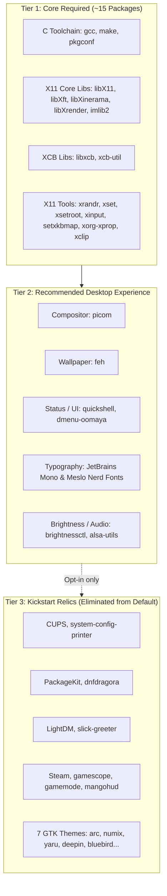

# Package Architecture Audit & Cross-Distro Premortem

**Author:** Antigravity Architect & Techlead  
**Date:** September 18, 2026  
**Status:** Under Review (Tollgate Required)  
**Target Repositories:** `dwm-oomaya`, `dmenu-oomaya`

---

## 1. Executive Summary & Root Cause Analysis

The consecutive installation failures encountered on CachyOS Niri (`target not found: xkbset`, followed by `target not found: xprop`) are symptoms of a deeper architectural misalignment:

> [!IMPORTANT]
> **The Identity Crisis:** `dwm-oomaya` inherited the DNA of `dwm-titus`, which was originally designed as a **monolithic Fedora Kickstart / fresh-install ISO builder** meant to turn a blank, bare-metal server into a complete workstation from scratch. It is not currently behaving like a clean, suckless window manager layer.

When deployed onto an existing, running Linux installation (such as CachyOS Niri or a personal laptop), the installer defaults to `DWM_INSTALL_PROFILE="full"`. This triggers an indiscriminate batch installation of over 50 packages—including printer daemons (`cups`), package managers (`PackageKit`), display managers (`lightdm`), gaming stacks (`steam`, `gamescope`), and 7 legacy GTK themes.

On non-Fedora distributions:
1. Package names diverge (`xprop` $\rightarrow$ `xorg-xprop` on Arch).
2. AUR-only packages (`xkbset`) fail in standard package manager transactions.
3. Debian support is completely missing in `scripts/dwm-packages.sh` despite claims in `install.sh`.
4. Overwriting active desktop components (like attempting to enable `lightdm.service` over an active `sddm` or `greetd`) introduces severe system instability.

---

## 2. The 3-Tier Package Architecture

To restore suckless simplicity and engineering discipline, all packages must be classified into three strict tiers:



### Tier 1: Core Required (Absolute Minimum to Build & Run)
Without these, `dwm` and `dmenu` cannot compile or handle basic X11 operations (window positioning, multi-monitor, clipboard, key bindings).
- **Toolchain:** `gcc`, `make`, `pkg-config`
- **X11 Libraries:** `libX11`, `libXft`, `libXinerama`, `libXrender`, `imlib2`, `libxcb`, `xcb-util`, `freetype2`, `fontconfig`
- **X11 Utilities:** `xrandr`, `xset`, `xsetroot`, `xinput`, `setxkbmap`, `xprop`, `xclip`, `xdotool`
- **Runtime:** `git`, `curl`, `procps`, `psmisc` (`killall`), `unzip`
- **Impact:** ~15 packages. Universal across all Linux distributions. Zero daemon overhead.

### Tier 2: Recommended Desktop Polish (Window Manager Experience)
Components that provide the modern Omarchy desktop visual language:
- **Compositor:** `picom` (transparent windows, rounded corners, blur)
- **Wallpaper:** `feh`
- **Shell / Menu:** `quickshell` (top bar / control center) and `dmenu-oomaya`
- **Typography:** JetBrains Mono Nerd Font & Meslo Nerd Font (installed locally into `~/.local/share/fonts/`, bypassing distro package managers to guarantee sharp Tokyo Night terminal rendering without glyph clipping)
- **Media Keys:** `brightnessctl`, `alsa-utils` / `pipewire-pulse` (only if not already provided)

### Tier 3: Distro Bloat & Kickstart Relics (Remove from Default)
These have **no place** in a window manager installer running on an existing Linux desktop:
- **Print Spooler:** `cups`, `system-config-printer`
- **Redundant Updaters:** `PackageKit`, `PackageKit-glib`, `dnfdragora`, `accountsservice`
- **Display Manager Overwrite:** `lightdm`, `slick-greeter` (endangers existing display managers like SDDM or Greetd)
- **Gaming Overkill:** `steam`, `gamescope`, `gamemode`, `mangohud`
- **GTK Theme Dump:** Arc, Numix, Yaru, Deepin, Bluebird (themes belong in user dotfiles, not root packages)

---

## 3. Cross-Platform Package Support Matrix

The following table provides the exact, verified package names across Fedora, Arch/CachyOS, and Debian/Ubuntu:

| Component / Function | Fedora (`dnf`) | Arch / CachyOS (`pacman`) | Debian / Ubuntu (`apt`) | Status / Notes |
| :--- | :--- | :--- | :--- | :--- |
| **C Toolchain** | `gcc make pkgconf-pkg-config` | `gcc make pkgconf` | `build-essential pkg-config` | Verified |
| **X11 Core Headers** | `libX11-devel libXinerama-devel` | `libx11 libxinerama` | `libx11-dev libxinerama-dev` | Verified |
| **Xft / Fontconfig** | `libXft-devel fontconfig-devel freetype-devel` | `libxft fontconfig freetype2` | `libxft-dev libfontconfig1-dev libfreetype-dev` | Verified |
| **Imlib2 & Render** | `libXrender-devel imlib2-devel` | `libxrender imlib2` | `libxrender-dev libimlib2-dev` | Verified |
| **XCB Libraries** | `libxcb-devel xcb-util-devel` | `libxcb xcb-util` | `libxcb1-dev libxcb-res0-dev libxcb-util-dev` | Verified |
| **XRandR (Display)** | `xrandr` | `xorg-xrandr` | `x11-xserver-utils` | **Arch difference** |
| **XSet / XSetRoot** | `xset xsetroot` | `xorg-xset xorg-xsetroot` | `x11-xserver-utils` | **Arch difference** |
| **XInput (Devices)** | `xinput` | `xorg-xinput` | `xinput` | **Arch difference** |
| **SetXkbMap** | `setxkbmap` | `xorg-setxkbmap` | `x11-xkb-utils` | **Arch difference** |
| **XProp (Window Inspect)**| `xprop` | **`xorg-xprop`** | `x11-utils` | **Failed on Arch: was `xprop`** |
| **XKB Set** | `xkbset` | *(None - AUR only)* | `xkbset` | **Removed: AUR-only on Arch** |
| **Clipboard / Exec** | `xclip xdotool` | `xclip xdotool` | `xclip xdotool` | Verified |
| **Compositor** | `picom` | `picom` | `picom` | Verified |
| **Wallpaper** | `feh` | `feh` | `feh` | Verified |
| **Quickshell** | `quickshell` | `quickshell` *(AUR/CachyOS)* | *(Manual / Cargo / Source)* | Official in Fedora 44 / CachyOS |

---

## 4. Premortem: Why Did These Failures Occur?

A premortem analysis identifies the systemic breakdowns in the development loop:

1. **Test Environment Isolation (The Fedora Blindspot):**
   - The test suite (`tests/test-fedora-packages.sh`) runs solely on Fedora 44 with Fedora-specific tools (`dnf repoquery`).
   - There was **zero continuous integration or unit testing** for Arch package availability (`pacman -Si`) or Debian capability (`apt-cache show`).
2. **Copy-Paste Package List Syndrome:**
   - Package names were copied verbatim from Fedora lists into Arch lists (`xprop`, `xkbset`) without verifying against Arch official package databases (`core`, `extra`, `multilib`).
3. **Inversion of Profile Defaults:**
   - In `install.sh`:
     ```bash
     INSTALL_PROFILE="${DWM_INSTALL_PROFILE:-full}"
     ```
   - Defaulting to `full` turned what should have been a lightweight 30-second window manager build into a high-risk 50-package system migration.
4. **Debian Phantom Support:**
   - `install.sh` and `dwm-utils.sh` detect Debian, but `scripts/dwm-packages.sh` contained literally **zero `debian:*` cases**. Any Debian user running `install.sh` would instantly crash at step 1.
5. **Display Manager Hostility:**
   - The installer unconditionally attempts to enable `lightdm.service` if no display manager is detected, risking clobbering the user's running display manager or Wayland greeter.

---

## 5. Architectural Remediation Plan

### Step 1: Default to a Lean, Safe Profile
Change `INSTALL_PROFILE="${DWM_INSTALL_PROFILE:-full}"` to:
- **Default:** `recommended` (Build + X11 + Picom + Feh + dmenu + Meslo Fonts).
- **Core Mode:** `core` (Build + X11 + dmenu only).
- **Full Mode:** `full` (Explicit opt-in via `--profile=full` for bare-metal fresh installs only).

### Step 2: Fix Arch Package Definitions
In `scripts/dwm-packages.sh`:
- Replace `xprop` with `xorg-xprop` in `arch:runtime-required`.
- Remove `system-management` (`cups`, `packagekit`, etc.) from default Arch profile.
- Treat `quickshell` as optional/external on standard Arch (handled by CachyOS repo or AUR).

### Step 3: Implement Native Debian Package Definitions
Add complete, verified `debian:*` profiles to `scripts/dwm-packages.sh`:
- `debian:build`: `build-essential pkg-config libx11-dev libxft-dev libxinerama-dev libxrender-dev libimlib2-dev libxcb1-dev libxcb-res0-dev libxcb-util-dev libfontconfig1-dev libfreetype-dev`
- `debian:x11`: `xorg x11-xserver-utils x11-utils x11-xkb-utils xinput`
- `debian:runtime-required`: `dbus-x11 curl git procps psmisc unzip xclip xdotool xdg-utils`
- `debian:desktop`: `picom feh libnotify-bin brightnessctl alsa-utils`

### Step 4: Safety Guards on System Daemons
- Never touch `lightdm`, `cups`, or `packagekit` unless `--profile=full` is explicitly passed.
- If a display manager is already present (or Wayland compositor is active), leave it untouched.

### Step 5: Distro-Aware Package Verification Test
Create `tests/test-package-names.sh` to syntactically validate package definitions and prevent regression.

---

## 6. Tollgate Decisions & User Alignment

Before executing code changes, please indicate your preference on the default installation profile:

1. **Option A (Recommended: Lean Desktop):**
   - Installs Core X11, Build Toolchain, `picom`, `feh`, `dmenu-oomaya`, and Meslo Nerd Font.
   - Completely removes `cups`, `packagekit`, `lightdm`, `steam`, and extra GTK themes from the default run.
2. **Option B (Ultra-Minimal Suckless Core):**
   - Installs ONLY the compiler, X11 libraries, and core X utilities (`xrandr`, `xset`, `xprop`).
   - Leaves all desktop utilities (compositor, wallpaper, status bar) entirely to the user's dotfiles.
