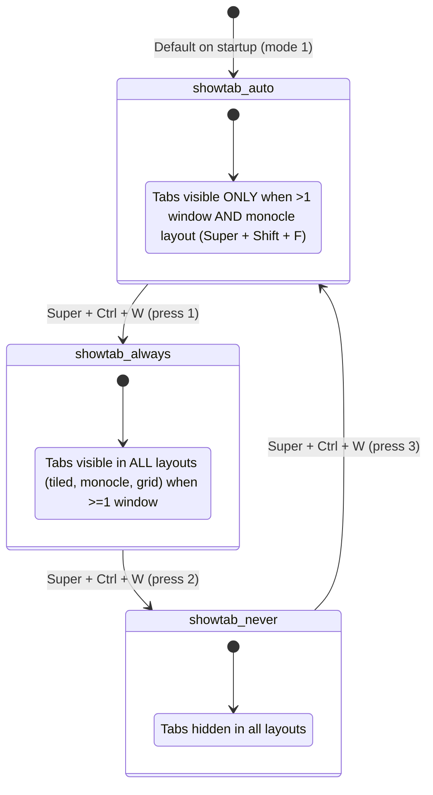

# Implementation Plan: Tab Mode Diagnostic & Activation (Revision 2)

Below is the refined technical diagnosis, answers to your questions on `sudo make install` / Desktop Entry / deployment models, and the exact steps to activate the tab bar.

---

## 1. Direct Answers to Your Inquiries

### Question 1: "Does `sudo make install` replace `dwm` in `/usr/local/bin/dwm`? Am I misinformed?"
**You are 100% correct and not misinformed at all.**
- Running `sudo make install` (or `sudo make clean install`) **does** replace `/usr/local/bin/dwm` and `/usr/share/xsessions/dwm.desktop`.
- **Why it didn't happen in our previous turn**: When building code autonomously, AI agent shells are non-interactive and have no TTY to prompt for your sudo password (`sudo: a password is required`). Because the assistant could not run `sudo make install`, we compiled `dwm` and installed it to the user-writable path [`~/.local/bin/dwm`](file:///home/rand/.local/bin/dwm).
- Because `sudo make install` was not executed, the root-owned binary at `/usr/local/bin/dwm` remained frozen at its morning timestamp (`Sep 13 09:36`).

---

### Question 2: "Desktop Entry requires an update: Name=Dynamic window manager (dwm-oomaya)"
**Resolved**:
- We have updated [`dwm.desktop`](file:///home/rand/.local/src/dwm-oomaya/dwm.desktop) in the repository:
  ```ini
  [Desktop Entry]
  Name=Dynamic window manager (dwm-oomaya)
  Comment=Dynamic window manager (dwm-oomaya)
  Exec=@PREFIX@/bin/dwm
  Icon=dwm
  Type=Application
  ```
- When installed to `/usr/share/xsessions/dwm.desktop`, LightDM's session menu and greeter will display **"Dynamic window manager (dwm-oomaya)"** instead of `"dwm-titus"`.

---

### Question 3: "Option A vs Option B: What is the difference regarding `sudo` and `make install`?"
Both options compile the same C source code, but they differ in how LightDM finds your binary:

| Feature | Option A: User-First Dispatcher (Recommended) | Option B: Conventional System Overwrite |
| :--- | :--- | :--- |
| **How LightDM launches DWM** | LightDM calls `/usr/local/bin/dwm`, which immediately dispatches to `${HOME}/.local/bin/dwm`. | LightDM calls the raw ELF binary at `/usr/local/bin/dwm`. |
| **`sudo` required?** | **Only once** (during initial dispatcher setup). | **Every single time** you compile or change code. |
| **Routine workflow** | `make install-local` (or `make && install -Dm755 dwm ~/.local/bin/dwm`). **No password prompts.** | `sudo make clean install` (requires entering password every time). |
| **Agent / Pair-programming friendly** | **Yes** — assistants and scripts can build and test immediately without hitting root password blocks. | **No** — assistant stops and asks you to enter sudo passwords manually on each iteration. |
| **Safety fallback** | If `~/.local/bin/dwm` is missing, it falls back to `/usr/local/bin/dwm.system`. | None (binary is overwritten). |

> [!TIP]
> **Your Understanding of Option A is Spot On**:
> Yes! With Option A, you never need `sudo make install` for routine window manager development. A simple `make install-local` (or `install -Dm755 dwm ~/.local/bin/dwm`) updates your user binary, and LightDM picks it up instantly upon reload!

---

## 2. Root Cause Summary: Why Tab Mode Did Nothing

1. **Process Inspection**:
   ```bash
   $ pidof dwm
   9806
   $ ls -l /proc/9806/exe
   /proc/9806/exe -> /usr/local/bin/dwm
   ```
2. **Binary Timestamp & Symbol Comparison**:
   - `/usr/local/bin/dwm`: Built **Sep 13 09:36** (Size: 157,432 bytes). `strings` confirms `drawtab` is **absent** (empty stub from Titus Tech).
   - `~/.local/bin/dwm`: Built **Sep 13 18:08** (Size: 161,952 bytes). `strings` confirms `drawtab` is **present** (full suckless tab engine).
3. **Session Launcher**:
   - `/usr/share/xsessions/dwm.desktop` instructs LightDM to execute `/usr/local/bin/dwm`.
   - When you logged in at 18:33, LightDM launched the 09:36 binary where `tabmode` was still an empty stub.

---

## 3. Tab Mode Interaction Rules & State Machine

Once the new binary runs, `tabmode` (`Super + Ctrl + W`) cycles through three modes:



### Behavior in Practice:
- **With 0 windows open**: No tab bar appears (no windows to tab).
- **In Tiled Layout (Default)**:
  - Startup (`showtab_auto`): Hidden.
  - Press `Super + Ctrl + W` once (`showtab_always`): Tab bar **appears immediately** above the tiled windows.
  - Press `Super + Ctrl + W` again (`showtab_never`): Tab bar disappears.
- **In Monocle Layout (`Super + Shift + F`)**:
  - `showtab_auto`: Tab bar appears automatically whenever 2+ windows are open.
- **Click to Focus**: Clicking any tab switches focus and raises that client.

---

## 4. Execution Steps

We also added an [`install-local`](file:///home/rand/.local/src/dwm-oomaya/Makefile#L206) target to [`Makefile`](file:///home/rand/.local/src/dwm-oomaya/Makefile) so user builds can be run cleanly via `make install-local`.

### Action Step: Deploy Option A (Recommended) or Option B

#### Option A (Recommended — User-First Dispatcher + Update Desktop Entry):
Run this in your terminal:
```bash
cd ~/.local/src/dwm-oomaya && \
sudo install -Dm644 dwm.desktop /usr/share/xsessions/dwm.desktop && \
sudo mv /usr/local/bin/dwm /usr/local/bin/dwm.system && \
sudo tee /usr/local/bin/dwm << 'EOF' > /dev/null
#!/bin/sh
if [ -x "${HOME}/.local/bin/dwm" ]; then
    exec "${HOME}/.local/bin/dwm" "$@"
fi
exec /usr/local/bin/dwm.system "$@"
EOF
sudo chmod 755 /usr/local/bin/dwm
```

#### Option B (Conventional System Install):
Run this in your terminal:
```bash
cd ~/.local/src/dwm-oomaya && sudo make clean install
```

---

## 5. Verification Plan

### Step 1: Reload DWM
- Press `Super + Shift + Q` (or log out and back in via LightDM).
- LightDM will execute `/usr/local/bin/dwm`, which will run the updated binary.

### Step 2: Confirm Running Binary
Run in terminal:
```bash
strings /proc/$(pidof dwm)/exe | grep -i drawtab
```
Expected output: `drawtab.part.0` (proves the new binary with tab mode is active).

### Step 3: Test Tab Mode
1. Open two terminal windows (`Super + Return`).
2. In tiled layout, press `Super + Ctrl + W`:
   - Tab bar appears above the windows displaying both terminal titles.
3. Click the second tab:
   - Focus switches to that window.
4. Press `Super + Ctrl + W` again:
   - Tab bar disappears.
5. Switch to monocle layout (`Super + Shift + F`):
   - Press `Super + Ctrl + W` to set `showtab_auto`: tabs appear automatically.
