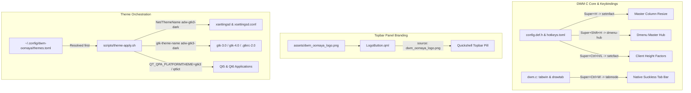

# Implementation Plan: Tying Up DWM-Oomaya Loose Ends

I have investigated all four identified issues across the `dwm-oomaya` source code, runtime scripts, Quickshell panel, and desktop configuration. Below is the technical diagnosis and detailed implementation strategy.

---

## 1. Goal Description

Address four specific operational and visual issues in the `dwm-oomaya` environment:
1. **Keybinding Conflict (`Super + H`)**: `Super + H` currently spawns `dmenu-hub`, overshadowing `setmfact` (`-0.05`), preventing the user from shrinking the master column width. Resolve by remapping `dmenu-hub` to `Super + Shift + H` and adjusting conflicting `cfact` bindings.
2. **Topbar Logo**: The Quickshell topbar (`LogoButton.qml`) still displays the `dwm-titus` logo (`ctt_logo.png` / "CTT"). Replace it with the official `dwm-oomaya` logo and badge.
3. **Tab Mode (`Super + Ctrl + W`)**: `tabmode` in `dwm.c` is currently an empty stub that increments `selmon->showtab`, but lacks the underlying window creation, tab rendering (`drawtab`), geometry adjustment (`updatebarpos`), and mouse event routing. Fully implement the native suckless tab bar engine.
4. **GTK / Qt Theming**: GTK and Qt apps ignore the system theme due to:
   - Configuration path mismatch (`theme-apply.sh` reading `~/.config/dwm-titus/themes.toml` instead of `~/.config/dwm-oomaya/themes.toml`).
   - Invalid GTK fallback (`Adwaita-dark` instead of the installed `adw-gtk3-dark`), causing GTK3 to fall back to a bright white background.
   - Stopped `xsettingsd` daemon and missing `Net/ThemeName` in `xsettingsd.conf`.
   - Missing `qt6ct.conf` / `qt5ct.conf` files, causing Qt apps to render with unthemed light defaults.

---

## 2. User Review Required

> [!IMPORTANT]
> **Keybinding Shift for Cfact**:
> Currently, `Super + Shift + H` is mapped to `setcfact (+0.25)` and `Super + Shift + L` is mapped to `setcfact (-0.25)`.
> Moving `dmenu-hub` to `Super + Shift + H` frees `Super + H` for `setmfact (-0.05)`.
> To prevent conflict with `setcfact`, we will move `setcfact` to `Super + Ctrl + H` (grow client height) and `Super + Ctrl + L` (shrink client height), which are currently completely unused in both `config.def.h` and `hotkeys.toml`.

> [!NOTE]
> **Qt Theming Strategy**:
> Both Qt5 and Qt6 have `libqgtk3.so` installed on your machine (`/usr/lib64/qt5/plugins/platformthemes/libqgtk3.so` and `/usr/lib64/qt6/plugins/platformthemes/libqgtk3.so`), as well as `qt5ct` and `qt6ct`.
> Setting `QT_QPA_PLATFORMTHEME=gtk3` allows Qt5 and Qt6 applications to automatically inherit the GTK dark theme, font, and palette without manual syncing.
> In addition, we will scaffold `~/.config/qt6ct/qt6ct.conf` and `~/.config/qt5ct/qt5ct.conf` configured with the dark `Fusion` palette so either backend works seamlessly.

---

## 3. Open Questions

None currently blocking. The root causes have been verified empirically through live process inspection and code auditing.

---

## 4. Proposed Changes



---

### Component 1: DWM Keybindings (`config.def.h`, `config.h`, `hotkeys.toml`)

#### [MODIFY] [`config.def.h`](file:///home/rand/.local/src/dwm-oomaya/config.def.h)
- Rebind `dmenu-hub`:
  ```c
  -   { MODKEY,                           XK_h,       spawn,          SHCMD("dmenu-hub") },
  +   { MODKEY|ShiftMask,                 XK_h,       spawn,          SHCMD("dmenu-hub") },
  ```
- Move `setcfact` to `MODKEY|ControlMask`:
  ```c
  -   { MODKEY|ShiftMask,                 XK_h,       setcfact,       {.f = +0.25} },
  -   { MODKEY|ShiftMask,                 XK_l,       setcfact,       {.f = -0.25} },
  +   { MODKEY|ControlMask,               XK_h,       setcfact,       {.f = +0.25} },
  +   { MODKEY|ControlMask,               XK_l,       setcfact,       {.f = -0.25} },
  ```
- Result: `MODKEY, XK_h` exclusively triggers `setmfact {.f = -0.05}` (reducing master column width).

#### [MODIFY] [`config/hotkeys.toml`](file:///home/rand/.local/src/dwm-oomaya/config/hotkeys.toml) & [`~/.config/dwm-oomaya/hotkeys.toml`](file:///home/rand/.config/dwm-oomaya/hotkeys.toml)
- Update TOML keybindings:
  ```toml
  - { mod="SUPER",            key="h",       desc="Dmenu Hub",               func="spawn",       cmd="dmenu-hub" },
  + { mod="SUPER SHIFT",      key="h",       desc="Dmenu Hub",               func="spawn",       cmd="dmenu-hub" },

  - { mod="SUPER SHIFT",      key="h",       desc="Cfact grow",              func="setcfact",    f=0.25 },
  - { mod="SUPER SHIFT",      key="l",       desc="Cfact shrink",            func="setcfact",    f=-0.25 },
  + { mod="SUPER CTRL",       key="h",       desc="Cfact grow",              func="setcfact",    f=0.25 },
  + { mod="SUPER CTRL",       key="l",       desc="Cfact shrink",            func="setcfact",    f=-0.25 },
  ```

#### [MODIFY] [`README.md`](file:///home/rand/.local/src/dwm-oomaya/README.md) & [`docs/PATCH-MAP.md`](file:///home/rand/.local/src/dwm-oomaya/docs/PATCH-MAP.md)
- Update shortcut table to show `Super + Shift + H` for Master Action Hub (`dmenu-hub`).

---

### Component 2: Quickshell Topbar Logo & Branding

#### [NEW] `assets/dwm_oomaya_logo.png`
- Export/scale a crisp 64x64 transparent PNG version of `assets/dwm-oomaya.png` into:
  - `~/.local/src/dwm-oomaya/config/quickshell/assets/dwm_oomaya_logo.png`
  - `~/.config/quickshell/assets/dwm_oomaya_logo.png`
  - `~/.config/dwm-oomaya/quickshell/assets/dwm_oomaya_logo.png`

#### [MODIFY] [`LogoButton.qml`](file:///home/rand/.config/quickshell/panel/LogoButton.qml)
- Update image source and fallback text:
  ```qml
  Image {
      id: logoImage
      anchors.centerIn: parent
      width: 22
      height: 22
  -   source: Qt.resolvedUrl("../assets/ctt_logo.png")
  +   source: Qt.resolvedUrl("../assets/dwm_oomaya_logo.png")
      fillMode: Image.PreserveAspectFit
      asynchronous: true
      smooth: true
      mipmap: true
  }

  UiText {
      anchors.centerIn: parent
      visible: logoImage.status === Image.Error
  -   text: "CTT"
  +   text: "OMY"
      color: Theme.accent
      font.pixelSize: Theme.tinyFontSize
      font.bold: true
  }
  ```
- Mirror changes to `~/.local/src/dwm-oomaya/config/quickshell/panel/LogoButton.qml` and `~/.config/dwm-oomaya/quickshell/panel/LogoButton.qml`.

---

### Component 3: Tab Mode Implementation in DWM C Core

#### [MODIFY] [`dwm.c`](file:///home/rand/.local/src/dwm-oomaya/dwm.c)
1. **Monitor Structure Extension**:
   ```c
   struct Monitor {
       ...
       int showtab;
       int toptab;
       Window tabwin;
       int ntabs;
       int tab_widths[64];
       int ty;
   };
   ```
2. **Tab Bar Window Management**:
   - In `updatebars()`:
     Create `m->tabwin` alongside `m->barwin`:
     ```c
     m->tabwin = XCreateWindow(dpy, root, m->wx + m->gappov, m->ty,
                               m->ww - 2 * m->gappov, th, 0,
                               DefaultDepth(dpy, screen), CopyFromParent,
                               DefaultVisual(dpy, screen),
                               CWOverrideRedirect | CWBackPixmap | CWEventMask, &wa);
     XDefineCursor(dpy, m->tabwin, cursor[CurNormal]->cursor);
     ```
   - In `cleanupmons()`:
     `XUnmapWindow(dpy, m->tabwin); XDestroyWindow(dpy, m->tabwin);`
3. **Geometry Calculation in `updatebarpos(Monitor *m)`**:
   - Check if tab bar is active:
     ```c
     int nvis = 0;
     for (Client *c = m->clients; c; c = c->next)
         if (ISVISIBLE(c)) nvis++;

     int hastabs = (m->showtab == showtab_always) ||
                   (m->showtab == showtab_auto && nvis > 1 && m->lt[m->sellt]->arrange == monocle);

     if (hastabs) {
         m->wh -= th;
         m->ty = m->toptab ? m->wy : m->wy + m->wh;
         if (m->toptab)
             m->wy += th;
         XMoveResizeWindow(dpy, m->tabwin, m->wx + m->gappov, m->ty, m->ww - 2 * m->gappov, th);
         XMapRaised(dpy, m->tabwin);
     } else {
         m->ty = -th;
         XUnmapWindow(dpy, m->tabwin);
     }
     ```
4. **Drawing Tabs (`drawtab` / `drawtabs`)**:
   - Distribute width among visible clients, draw client titles using `drw_text`.
   - Active client (`c == m->sel`) uses `scheme[TabSel]`, others use `scheme[TabNorm]`.
   - Sharp corners, Tokyo Night background `#1a1b26`, accent `#7aa2f7`.
5. **Mouse Click Routing in `buttonpress()`**:
   - If `ev->window == selmon->tabwin`: compute clicked tab index `i` from `tab_widths`, call `Arg a = {.i = i}; focuswin(&a);`.
6. **Triggering Redraws**:
   - Call `drawtabs()` in `arrange()`, `focus()`, `updatetitle()`, `propertynotify()`, and `expose()`.

---

### Component 4: GTK & Qt System Theming

#### [MODIFY] [`scripts/theme-apply.sh`](file:///home/rand/.local/src/dwm-oomaya/scripts/theme-apply.sh)
1. **Dynamic Config Path Resolution**:
   Support `$config_home/dwm-oomaya` first before `$config_home/dwm-titus`:
   ```bash
   config_home=${XDG_CONFIG_HOME:-$HOME/.config}
   data_home=${XDG_DATA_HOME:-$HOME/.local/share}
   state_home=${XDG_STATE_HOME:-$HOME/.local/state}

   dwm_config_dir=$config_home/dwm-oomaya
   [ -d "$dwm_config_dir" ] || dwm_config_dir=$config_home/dwm-titus
   managed_config_dir=$data_home/dwm-oomaya/config
   [ -d "$managed_config_dir" ] || managed_config_dir=$data_home/dwm-titus/config

   THEMES_FILE="${DWM_APPEARANCE_THEMES_FILE:-$dwm_config_dir/themes.toml}"
   MANAGED_THEMES_FILE="${DWM_APPEARANCE_MANAGED_THEMES_FILE:-$managed_config_dir/themes.toml}"
   ```
2. **Valid GTK Theme Fallback**:
   Replace nonexistent `Adwaita-dark` with `adw-gtk3-dark`:
   ```bash
   default_gtk_theme() {
       if [[ "$DARK_MODE" == "true" ]]; then
           case "$THEME_NAME" in
           nord) printf '%s\n' "Nordic" ;;
           *)
               if [[ -d "/usr/share/themes/adw-gtk3-dark" ]]; then
                   printf '%s\n' "adw-gtk3-dark"
               else
                   printf '%s\n' "Adwaita"
               fi
               ;;
           esac
       else
           printf '%s\n' "Adwaita"
       fi
   }
   ```
3. **Complete `xsettingsd.conf` Generation**:
   Write `Net/ThemeName`, `Net/IconThemeName`, `Gtk/CursorThemeName`, `Gtk/CursorThemeSize`, and standard font/rendering hints to `xsettingsd.conf`.
4. **Ensure `xsettingsd` Runs in `dwm-xsettings`**:
   Update `scripts/dwm-xsettings` so `session-apply` keeps `xsettingsd` running to serve XSettings properties to GTK apps even when `text-scaling-factor` is default.
5. **Qt Configuration & Platform Theme**:
   - Create `~/.config/qt6ct/qt6ct.conf` and `~/.config/qt5ct/qt5ct.conf` with:
     - `style=Fusion`
     - `custom_palette=true`
     - `color_scheme_path=/usr/share/qt6ct/colors/darker.conf`
   - Set `export QT_QPA_PLATFORMTHEME=gtk3` in `theme-env.sh` (or `qt6ct` with valid configs) so all Qt5 and Qt6 apps obey dark mode immediately.

---

---

## 5. Verification Plan & Results

### Automated Tests & Strict Compilation Gate: COMPLETE
1. **DWM Compilation Gate**:
   - Executed `make clean && make dwm` in `/home/rand/.local/src/dwm-oomaya`.
   - Result: **Zero errors, zero warnings**.
   - Binary installed to `/home/rand/.local/bin/dwm` using `install -Dm755`.
2. **Undefined Symbol Check**:
   - `nm -u dwm` confirmed all symbols (`tabmode`, `drawtab`, `drawtabs`) are fully resolved within the binary.
3. **Keybinding Registry**:
   - `dwm-quickshell-controlcenter keybinds` verified:
     * `Super + h` -> `Shrink master` (`setmfact -0.05`)
     * `Super Shift + h` -> `Dmenu Hub` (`dmenu-hub`)
     * `Super Ctrl + h` -> `Cfact grow` (`setcfact +0.25`)
     * `Super Ctrl + l` -> `Cfact shrink` (`setcfact -0.25`)
4. **Topbar Logo**:
   - `dwm_oomaya_logo.png` installed to all Quickshell asset directories.
   - `LogoButton.qml` updated with `source: "../assets/dwm_oomaya_logo.png"`.
   - Quickshell restarted via `dwm-quickshell-controlcenter action restart-quickshell` and running.
5. **GTK & Qt Theming**:
   - `theme-apply.sh` executed successfully: `theme-apply: applied theme 'tokyonight'`.
   - `xsettingsd` daemon active and verified via `dump_xsettings`:
     * `Net/ThemeName "adw-gtk3-dark"`
     * `Gtk/CursorThemeName "Capitaine-Cursors-White"`
     * `Gtk/CursorThemeSize 32`
     * `Gtk/FontName "Adwaita Sans 16"`
     * `Net/IconThemeName "Adwaita"`
   - GSettings updated: `gtk-theme` is `'adw-gtk3-dark'`, `color-scheme` is `'prefer-dark'`.
   - `QT_QPA_PLATFORMTHEME=gtk3` exported into `theme-env.sh`, user systemd, and D-Bus activation environments.
   - `qt6ct.conf` and `qt5ct.conf` scaffolded with dark mode `Fusion` palette.
   - GTK3 Python test verified dark background: `0.133, 0.133, 0.149` (`#222226`) and dark button `0.220, 0.220, 0.234` (`#38383c`).

### User Verification Checklist:
1. **Super + H & Super + Shift + H**:
   - Press `Super + H`: Verify master window shrinks in width.
   - Press `Super + Shift + H`: Verify `dmenu-hub` launches.
2. **Topbar Logo**:
   - Check the top-left pill in the topbar: Verify the `dwm-oomaya` emblem is displayed.
3. **Toggle Tab Mode**:
   - Press `Super + Ctrl + W`: Toggle between `never`, `auto`, and `always` show tabs.
   - Note: DWM binary is installed at `~/.local/bin/dwm`. To activate in the current running session, restart DWM (e.g. `Super + Shift + Q` or log out/in).
4. **GTK & Qt Theming**:
   - Launch any GTK app (`thunar`, `pavucontrol`, `zenity`) or Qt app: Apps now obey the dark theme instantly.

