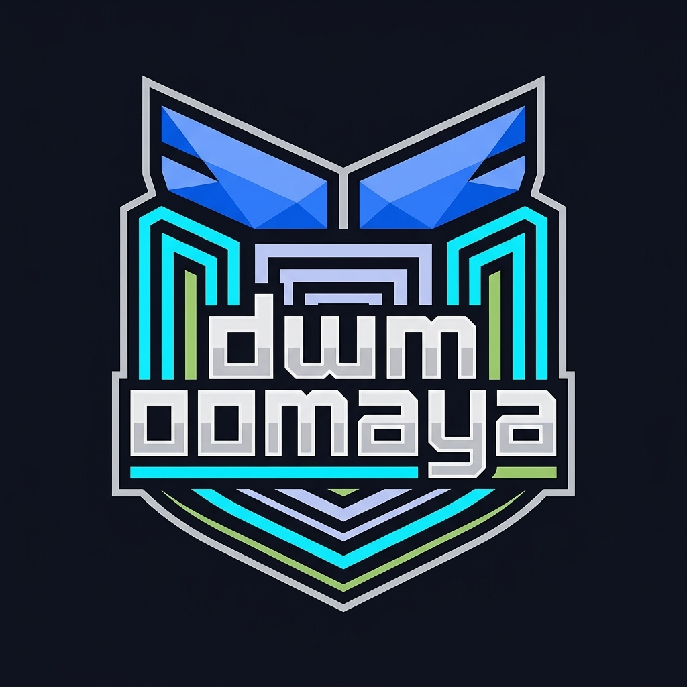
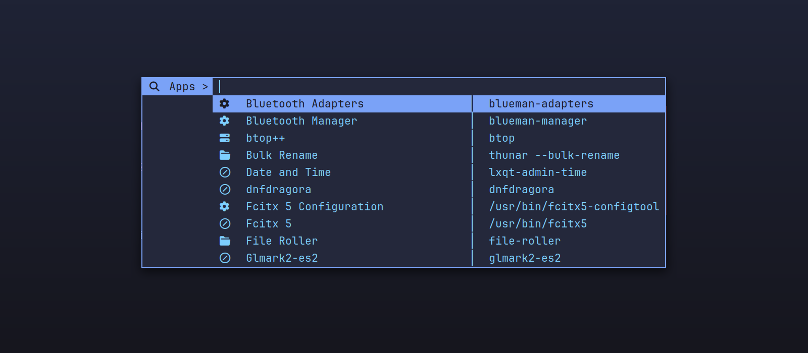
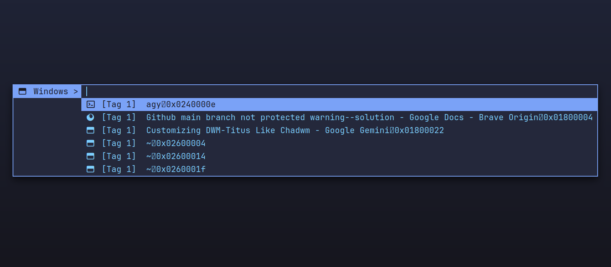
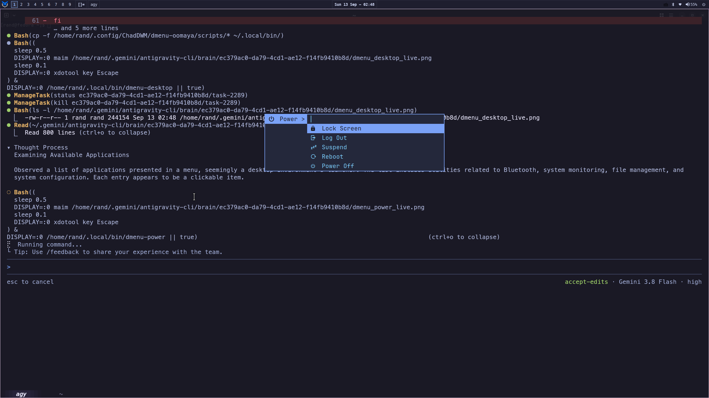
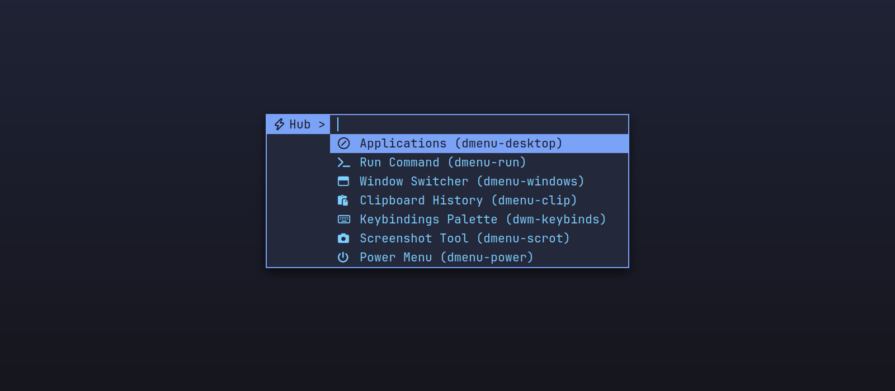

<div align="center">
  
  <h1>DWM-OOMAYA</h1>
  <p><strong>A high-performance, keyboard-driven suckless X11 desktop environment engineered for speed, sharp-corner aesthetics, and zero bloat.</strong></p>

  <p>
    <a href="https://github.com/oomaya/dwm-oomaya/releases"></a>
    <a href="https://github.com/oomaya/dwm-oomaya/blob/master/LICENSE"></a>
    <a href="#installation--quickstart"></a>
    <a href="#aesthetic-standards"></a>
    <a href="#14-vanitygaps-layouts"></a>
  </p>

  <p>
    <a href="#key-features">Key Features</a> •
    <a href="#visual-showcase">Showcase</a> •
    <a href="#keyboard-mastery">Keybindings</a> •
    <a href="#centered-dmenu-ecosystem">Dmenu Suite</a> •
    <a href="#installation--quickstart">Installation</a> •
    <a href="./docs/ARCHITECTURE.md">Architecture</a> •
    <a href="#architectural-lineage">Lineage</a>
  </p>
</div>

---

## What is DWM-Oomaya?

**DWM-Oomaya** combines the microsecond speed of suckless `dwm` with the modern UI ergonomics of **ChadDWM**, the robust Fedora & Quickshell integration of **DWM-Titus**, and the sharp-cornered brutalist visual grammar of **Omarchy / OMACOM**. 

It eliminates desktop friction:
- **Zero bloat**: Pure C99 compiled with `-Os` (~150KB core binary).
- **Zero daemon overhead**: Sub-2ms POSIX shell utilities replacing heavy background daemons.
- **Zero restart friction**: Hot-reload dwm in RAM under the same PID without tearing down your X session or dropping open windows.
- **Universal compatibility**: Built and tested on **Fedora Linux**, with 100% native build parity across **Arch Linux**, **Debian**, and any standard X11 environment.

---

## Key Features

### 🌀 1. 14 Vanitygaps Layouts & Live Topbar Indicator
Dynamic window tiling with independent inner and outer pixel gaps (`gappih`, `gappiv`, `gappoh`, `gappov`). Cycle layouts dynamically with instant visual feedback exported via the `_DWM_CURRENT_LAYOUT` atom to the Quickshell topbar.

| Symbol | Layout | Description | Gap-Aware |
| :---: | :--- | :--- | :---: |
| `[]=` | **Tile** | Master on left, vertical stack on right | Yes |
| `[M]` | **Monocle** | Maximized single window with focus tracking | N/A |
| `[@]` | **Spiral** | Fibonacci spiral arranging windows in golden-ratio increments | Yes |
| `[\\]`| **Dwindle** | Fibonacci dwindle tiled recursively | Yes |
| `H[]` | **Deck** | Master window beside stacked card deck | Yes |
| `TTT` | **Bottomstack** | Master on top, vertical columns underneath | Yes |
| `===` | **Bottomstack Horiz** | Master on top, horizontal rows underneath | Yes |
| `HHH` | **Grid** | Equal-ratio responsive grid layout | Yes |
| `###` | **Nrowgrid** | Configurable N-row adaptive grid | Yes |
| `---` | **Horizgrid** | Horizontal grid partition | Yes |
| `:::` | **Gaplessgrid** | Pure edge-to-edge gapless grid | Yes |
| `\|M\|`| **Centered Master** | Focused master window flanked by stack columns | Yes |
| `>M>` | **Centered Float Master** | Floating master window centered above background stack | Yes |
| `><>` | **Floating** | Free-floating X11 window placement | N/A |

### ⚡ 2. Seamless In-Place Self-Restart
Pressing **<kbd>Super</kbd> + <kbd>Shift</kbd> + <kbd>R</kbd>** performs an atomic in-place restart (`execvp("dwm", argv)`). dwm unmanages clients, closes display connections, and replaces its executable in memory under the same PID—reloading changes without session termination or losing your work!

### 🎯 3. `focusonnetactive` Window Navigation
Full EWMH `_NET_ACTIVE_WINDOW` compliance: when an external tool (such as `dmenu-windows` or `wmctrl`) requests focus, dwm automatically switches the workspace view, unhides hidden clients, raises the window, and warps the pointer smoothly.

### 🎨 4. Sharp-Corner Aesthetic Law & 16pt Typography
- **2px crisp square borders** (`#7aa2f7` Tokyo Night accent blue). Zero artificial rounding or blur gimmicks.
- **16pt Typography Floor**: JetBrains Mono & Meslo Nerd Font standard with proportional line heights (`-h 34`) to ensure zero glyph or icon clipping across terminals, menus, and status panels.

### ⚙️ 5. Live-Reloading TOML Runtime Configuration
Personal settings live in standard XDG user paths:
- `~/.config/dwm-oomaya/hotkeys.toml`: Keybindings reload on save.
- `~/.config/dwm-oomaya/themes.toml`: Tokyo Night color roles and palette hot-reload.
- `~/.config/dwm-oomaya/window-rules.toml`: Application tag assignment and floating rules.

---

## Visual Showcase

<div align="center">
  <h3>Real-Time Topbar Mode Pill (Spiral Layout)</h3>
  
</div>

<br/>

<div align="center">
  <table>
    <tr>
      <td align="center" width="50%">
        <strong>Centered App Launcher (<code>dmenu-desktop</code>)</strong><br/><br/>
        
      </td>
      <td align="center" width="50%">
        <strong>Interactive Window Switcher (<code>dmenu-windows</code>)</strong><br/><br/>
        
      </td>
    </tr>
    <tr>
      <td align="center" width="50%">
        <strong>Session & Power Menu (<code>dmenu-power</code>)</strong><br/><br/>
        
      </td>
      <td align="center" width="50%">
        <strong>Master Action Hub (<code>dmenu-hub</code>)</strong><br/><br/>
        
      </td>
    </tr>
  </table>
</div>

---

## Centered Dmenu Ecosystem

DWM-Oomaya pairs with [`dmenu-oomaya`](https://github.com/oomaya/dmenu-oomaya), a centered, border-aware, fuzzy-matching suckless dmenu engine with a dedicated POSIX scripting suite:

- **`dmenu-desktop`**: Sub-millisecond XDG `.desktop` launcher with category tagging (🌐 Web, 💻 Terminal, 📝 Code, 📁 Files, ⚙️ Settings, 📊 Monitor), elegant vertical dividers `│`, and terminal auto-wrapping.
- **`dmenu-windows`**: Interactive workspace tag window switcher querying `wmctrl -l` and switching tags instantly.
- **`dmenu-power`**: Centered session management (Lock, Logout, Suspend, Reboot, Shutdown) with confirmation modals.
- **`dmenu-run`**: Fast `$PATH` command execution with distance-scored fuzzy search.
- **`dmenu-clip`**: Ultra-light clipboard history manager supporting PRIMARY and CLIPBOARD selections.
- **`dmenu-scrot`**: Screenshot capture utility for Fullscreen, Area Select, and Active Window modes via `maim`.
- **`dmenu-hub`**: Master launcher linking all scripts and controls into a single palette.

---

## Keyboard Mastery

### Launchers & Terminals
| Action | Keybinding | Command |
| :--- | :--- | :--- |
| **Primary Terminal** | <kbd>Super</kbd> + <kbd>Shift</kbd> + <kbd>Enter</kbd> | `ghostty` \|\| `kitty` |
| **Alacritty Terminal** | <kbd>Super</kbd> + <kbd>A</kbd> | `alacritty` |
| **Application Launcher** | <kbd>Super</kbd> + <kbd>C</kbd> / <kbd>Super</kbd> + <kbd>D</kbd> | `dmenu-desktop` |
| **Interactive Window Switcher** | <kbd>Alt</kbd> + <kbd>Tab</kbd> | `dmenu-windows` |
| **Command Runner** | <kbd>Alt</kbd> + <kbd>P</kbd> | `dmenu-run` |
| **Power Menu** | <kbd>Alt</kbd> + <kbd>X</kbd> | `dmenu-power` |
| **Master Action Hub** | <kbd>Super</kbd> + <kbd>Shift</kbd> + <kbd>H</kbd> | `dmenu-hub` |
| **Keybindings Palette** | <kbd>Super</kbd> + <kbd>/</kbd> | Quickshell Keybinds / `dwm-keybinds` |

### Window Management & Tiling
| Action | Keybinding |
| :--- | :--- |
| **Focus Next / Previous Window** | <kbd>Super</kbd> + <kbd>J</kbd> / <kbd>Super</kbd> + <kbd>K</kbd> |
| **Move Window Down / Up** | <kbd>Super</kbd> + <kbd>Shift</kbd> + <kbd>J</kbd> / <kbd>Super</kbd> + <kbd>Shift</kbd> + <kbd>K</kbd> |
| **Promote to Master** | <kbd>Super</kbd> + <kbd>Enter</kbd> |
| **Close Focused Window** | <kbd>Super</kbd> + <kbd>Q</kbd> |
| **Toggle Floating** | <kbd>Super</kbd> + <kbd>Space</kbd> |
| **Actual Fullscreen** | <kbd>Super</kbd> + <kbd>F</kbd> |
| **Hide / Restore Window** | <kbd>Super</kbd> + <kbd>H</kbd> / <kbd>Super</kbd> + <kbd>Shift</kbd> + <kbd>H</kbd> |

### Layout & Gap Controls
| Action | Keybinding |
| :--- | :--- |
| **Cycle Layouts** | <kbd>Super</kbd> + <kbd>Tab</kbd> |
| **Switch to Tile Layout** | <kbd>Super</kbd> + <kbd>T</kbd> |
| **Switch to Monocle Layout** | <kbd>Super</kbd> + <kbd>M</kbd> |
| **Toggle All Gaps** | <kbd>Super</kbd> + <kbd>Alt</kbd> + <kbd>0</kbd> |
| **Increase / Decrease Gaps** | <kbd>Super</kbd> + <kbd>Alt</kbd> + <kbd>=</kbd> / <kbd>-</kbd> |
| **Reset Default Gaps** | <kbd>Super</kbd> + <kbd>Alt</kbd> + <kbd>Shift</kbd> + <kbd>=</kbd> |

### System & Session
| Action | Keybinding |
| :--- | :--- |
| **In-Place DWM Self-Restart** | <kbd>Super</kbd> + <kbd>Shift</kbd> + <kbd>R</kbd> |
| **Restart Quickshell Shell** | <kbd>Super</kbd> + <kbd>Ctrl</kbd> + <kbd>R</kbd> |
| **Screenshot Area** | <kbd>Super</kbd> + <kbd>U</kbd> (`maim --select`) |
| **Screenshot Fullscreen** | <kbd>Super</kbd> + <kbd>Ctrl</kbd> + <kbd>U</kbd> (`maim`) |
| **Screenshot Menu** | <kbd>Super</kbd> + <kbd>Print</kbd> (`dmenu-scrot`) |

---

## Installation & Quickstart

### 1. Install Build Dependencies

**Fedora Linux:**
```bash
sudo dnf install gcc make libX11-devel libXinerama-devel libXft-devel fontconfig-devel wmctrl xclip maim
```

**Arch Linux:**
```bash
sudo pacman -S base-devel libx11 libxinerama libxft fontconfig xorg-xinit wmctrl xclip maim
```

**Debian / Ubuntu:**
```bash
sudo apt install build-essential libx11-dev libxinerama-dev libxft-dev libfontconfig1-dev wmctrl xclip maim
```

---

### 2. Build & Install

```bash
# Clone the repository
git clone https://github.com/oomaya/dwm-oomaya.git ~/.local/src/dwm-oomaya
cd ~/.local/src/dwm-oomaya

# Compile cleanly
make -j$(nproc) dwm

# Install user binary to ~/.local/bin/
install -Dm755 dwm ~/.local/bin/dwm

# Install system-wide to /usr/local/bin/
sudo make install-system
```

---

### 3. Install the Dmenu Ecosystem

```bash
git clone https://github.com/oomaya/dmenu-oomaya.git ~/.local/src/dmenu-oomaya
cd ~/.local/src/dmenu-oomaya

# Build and install dmenu binary and scripts
make -j$(nproc)
install -Dm755 dmenu ~/.local/bin/dmenu
cp -a scripts/dmenu-* ~/.local/bin/
```

Ensure `~/.local/bin` is in your `$PATH` (e.g. in `~/.bashrc` or `~/.profile`):
```bash
export PATH="$HOME/.local/bin:$PATH"
```

---

## Systems Architecture & Deep Dive

For an exhaustive, step-by-step technical breakdown of the C patches, vanitygaps geometry mathematics, X11 root window atom IPC (`_DWM_CURRENT_LAYOUT`), EWMH `focusonnetactive` surgery, sub-millisecond POSIX `awk` application indexing, and kernel process-replacement mechanics (`execvp` and `ETXTBSY`), consult our complete engineering deliverable:

👉 **[DWM-OOMAYA Systems Engineering & Architecture Reference](./docs/ARCHITECTURE.md)**

---

## Architectural Lineage

DWM-Oomaya stands on the shoulders of the suckless and open-source Unix community:

```
                  ┌──────────────────────┐
                  │     Suckless DWM     │  (Pure microsecond C window manager)
                  └──────────┬───────────┘
                             │
            ┌────────────────┴────────────────┐
            ▼                                 ▼
┌──────────────────────┐            ┌──────────────────────┐
│       ChadDWM        │            │      DWM-Titus       │
│  (Vanitygaps, Cfacts,│            │ (Fedora integration, │
│   ergonomic layouts) │            │  Quickshell panel)   │
└───────────┬──────────┘            └──────────┬───────────┘
            │                                  │
            │      ┌────────────────────┐      │
            └─────►│   Omarchy / OMA    ├──────┘
                   │(Brutalist grammar, │
                   │ Tokyo Night design)│
                   └─────────┬──────────┘
                             ▼
                  ┌──────────────────────┐
                  │      DWM-OOMAYA      │  (The synthesized masterpiece)
                  └──────────────────────┘
```

- **[suckless.org](https://suckless.org/)**: The elegant, minimal C core and dynamic window management foundation.
- **[ChadDWM](https://github.com/siduck/chadwm)**: Vanitygaps architecture, layout matrix, and ergonomic mouse drag resize controls.
- **[DWM-Titus](https://github.com/ChrisTitusTech/dwm-titus)**: Chris Titus's desktop framework, Quickshell status orchestration, and live TOML parser.
- **[Omarchy](https://omarchy.org/)**: DHH & 37signals' brutalist visual grammar, sharp-corner discipline, and elegant window-launcher conventions.
- **[Tony Banters Dmenu](https://github.com/tonybanters/dmenu)**: Centered geometry, crisp border patch, and Tokyo Night aesthetic.

---

## License

DWM-Oomaya is free software released under the **GNU General Public License v3** (GPLv3) to preserve user freedoms, with core suckless components under the MIT / X Consortium license. See [LICENSE](./LICENSE) for details.
