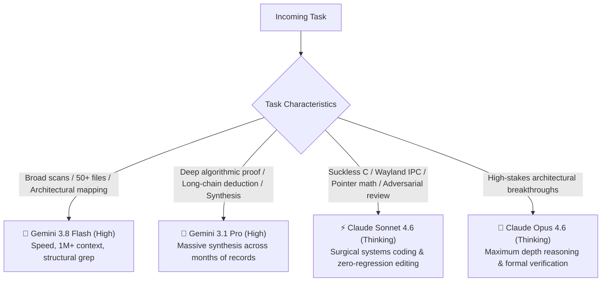
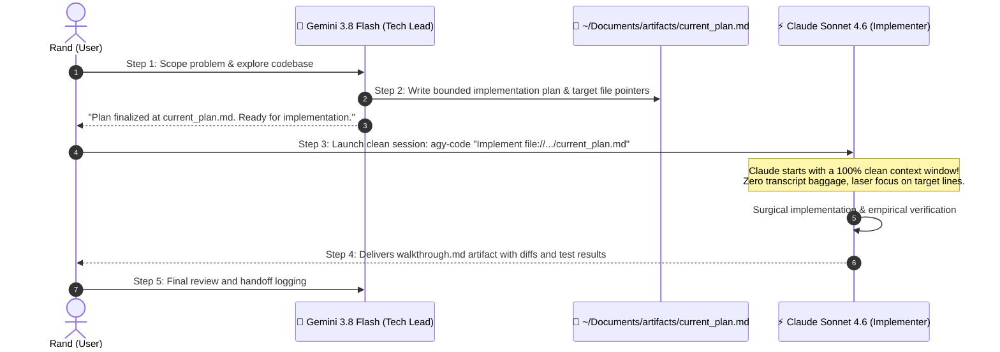

# Systems Craftsmanship: Antigravity Suite Updates & Dual-Model Synergy Guide

A comprehensive architectural manual and operational runbook on automating **Antigravity Suite (CLI & IDE)** lifecycle updates with zero token bloat, executing the **Artifact-Handoff Protocol** for pristine context sharing, and leveraging **Claude Sonnet/Opus** alongside **Gemini** in an optimal pair-programming symbiosis.

---

## 1. The Dual-Model Synergy Matrix

Google Antigravity natively integrates industry-leading frontier models. Rather than defaulting to a single model for all tasks, peak development velocity is achieved by routing tasks according to model specialization:



### Strategic Workload Routing

| Domain / Workload | Optimal Model | Why This Model Excels | Concrete Trigger / CLI Alias |
| :--- | :--- | :--- | :--- |
| **Suckless C Core & Layouts** | **`claude-sonnet-4-6`** | Flawless pointer arithmetic, bounds checking, X11 event loop logic without off-by-one errors in `dwm.c`/`drw.c`. | `agy-code "Fix layout cycle in dwm.c"` |
| **Wayland & Linux IPC Plumbing** | **`claude-sonnet-4-6`** | Precision Lua/C IPC dispatching (`hyprctl`, `niri`), avoiding subprocess injection and string escaping traps. | `agy-code "Fix atomic focus in hyprland.lua"` |
| **Adversarial Code Review** | **`claude-sonnet-4-6`** | Deeply skeptical auditor. Catches unquoted bash expansions, race conditions, and signal leaks that Gemini glides over. | `agy-code "Audit scripts/dwm-app-install"` |
| **Multi-File Codemods** | **`claude-sonnet-4-6`** | Surgical editing precision. Never drops comments or alters whitespace unnecessarily across 10+ files. | `agy-code "Refactor notification calls"` |
| **High-Context Repository Audits** | **`gemini-3.8-flash-high`** | 1M+ token context window. Ingests dozens of files across 3 repositories in sub-seconds with zero latency friction. | `agy-plan "Audit all scripts invoking dmenu"` |
| **Fast-Path Architectural Planning** | **`gemini-3.8-flash-high`** | Low-latency drafting of structured implementation plans and technical specifications. | `agy-plan "Design a multi-machine sync daemon"` |
| **Deep Historical Synthesis** | **`gemini-3.1-pro-high`** | Reasoning across massive document troves in `~/Vault` to distill multi-month architectural patterns. | `agy-pro "Synthesize post-mortems into a rule"` |
| **Active Quota Failover** | **`claude-sonnet-4-6`** | Instant, zero-downtime failover during hourly Gemini API spikes or 503 capacity limits. | `agy -m claude-sonnet-4-6 -c` |

---

## 2. The Artifact-Handoff Protocol: Context Sharing Without Token Bloat

> [!CAUTION]
> **The Chat Transcript Accumulation Trap**:
> Continuing a single conversation across dozens of turns accumulates massive transcript history (50,000+ tokens). This inflates prompt costs, hits hourly provider quotas, and triggers attention degradation ("lost in the middle").

### The Protocol Flow

Instead of carrying bloated chat transcripts between models, models communicate asynchronously through **Structured Markdown Artifacts**:



### Why the Artifact-Handoff Protocol is 10x More Efficient:
1. **Clean Attention Window**: The implementer model (Claude) starts fresh, focusing 100% of its reasoning budget on the code rather than parsing 40 turns of conversational chat.
2. **Model Independence**: Seamlessly switch models between phases (Gemini scopes $\rightarrow$ Claude codes $\rightarrow$ Claude audits $\rightarrow$ Gemini documents).
3. **Auditability**: Every handoff is preserved as a version-controlled markdown document in `~/antigravity-vault` (`oomaya/vault`).

---

## 3. Shell Ergonomics: Terminal Aliases

Configured in `~/.bashrc` and `~/dotfiles/bash/.bashrc`:

```bash
# Antigravity Model Synergy Aliases
alias agy-code="agy --model claude-sonnet-4-6"          # Deep systems coder (Claude Sonnet 4.6 Thinking)
alias agy-opus="agy --model claude-opus-4-6-thinking"  # High-depth reasoning (Claude Opus 4.6 Thinking)
alias agy-plan="agy --model gemini-3.8-flash-high --mode plan" # Rapid architect (Gemini 3.8 Flash)
alias agy-pro="agy --model gemini-3.1-pro-high"         # Heavy synthesis (Gemini 3.1 Pro)
```

### Real-Life Terminal Workflows

```bash
# 1. Surgical Systems Bug Fix (Claude mounts cwd, git state, and active skills):
cd ~/dwm-oomaya
agy-code "We are seeing layout collapse when pressing Super+D. Inspect keys[] in config.def.h and dwm.c."

# 2. Planning a New Feature (Gemini Flash creates blueprint):
cd ~/.dotfiles
agy-plan "Design a new wayland notification daemon module for omarchy"

# 3. Interactive Prompt with Claude:
cd ~/.config/hypr
agy-code -i "Refactor window focus logic to use atomic Lua dispatch"

# 4. Resuming Latest Conversation with Claude Failover:
agy -m claude-sonnet-4-6 -c
```

---

## 4. Agent-Triad Guardrails: The 1-Revision Law (`MAX_ROUND_COUNT=2`)

When orchestrating a 3-agent triad (Designer, Reviewer, Mediator), unconstrained debate can result in a "token-fire." The updated [`agent-triad` skill](file:///home/rand/.local/src/antigravity-skills/skills/agent-triad/SKILL.md) enforces two strict architectural controls:

1. **`MAX_ROUND_COUNT=2` (The 1-Revision Law)**:
   - **Round 1**: Designer drafts architecture/code $\rightarrow$ Reviewer executes empirical tests and grades 5 vectors.
   - **Round 2**: Designer applies surgical fixes addressing feedback $\rightarrow$ Reviewer audits the fixes.
   - **Immediate Escalation**: If consensus is not reached after Round 2, debate **immediately halts**. The Mediator summarizes remaining trade-offs and escalates to the Human Partner (Rand) for a binding tie-breaker decision.
2. **Mandatory Consensus File Offload**:
   - Final deliverables are **never dumped into chat**.
   - Output is automatically written to `~/Documents/artifacts/current_plan.md` *(convenience mirror: `current/triad_consensus.md`)*.

---

## 5. Zero-Token Automated Suite Updater (`agy-update`)

The `agy-update` orchestrator solves the friction of keeping both the CLI and IDE in sync across your machine fleet with zero token expenditure.

### Architecture & Capabilities

```text
agy-update
├── [1/2] CLI Engine: Runs native 'agy update' silently
└── [2/2] IDE Engine:
    ├── Auto-detects 'Antigravity IDE*.tar.gz' in ~/Downloads (from antigravity.google)
    ├── Compares archive timestamp against installed instance in ~/.local/share/antigravity
    ├── Invokes 'app-install --user' in < 1 second
    ├── Applies atomic symlink swap (~/.local/bin/antigravity) to prevent ETXTBSY crashes
    ├── Defensively updates XDG desktop database
    └── Sends optional desktop notification via notify-send
```

### Usage & CLI Flags

```bash
# 1. Full automatic update (CLI + newest IDE archive in ~/Downloads):
agy-update

# 2. Inspect versions without making changes:
agy-update --check

# 3. Ingest explicit IDE archive from custom path:
agy-update --ide ~/Downloads/Antigravity\ IDE.tar.gz

# 4. Force re-installation of IDE even if timestamps match:
agy-update --force

# 5. Quiet mode (ideal for cron or non-blocking startup hooks):
agy-update --quiet
```

### Defensive Error Boundaries
- **`ETXTBSY` Protection**: Uses atomic symlink pointer swapping (`ln -sfn`) rather than copying files over an actively running IDE process.
- **Rollback Staging**: Backs up the previous version to `~/.local/share/antigravity.bak` until the new installation verifies cleanly.
- **Defensive Database Updates**: Guards `update-desktop-database` with `command -v` to prevent unexpected script crashes on minimal or headless systems.

---

## 6. Summary Checklist

- [ ] Model chosen according to the **Model Specialization Matrix** (Gemini for breadth/planning; Claude for surgical C/systems).
- [ ] Context shared cleanly via the **Artifact-Handoff Protocol** (`current_plan.md`) without transcript bloat.
- [ ] Triad loops bounded by the **1-Revision Law** (`MAX_ROUND_COUNT=2`).
- [ ] Antigravity CLI and IDE maintained seamlessly via `agy-update` and `app-install`.
