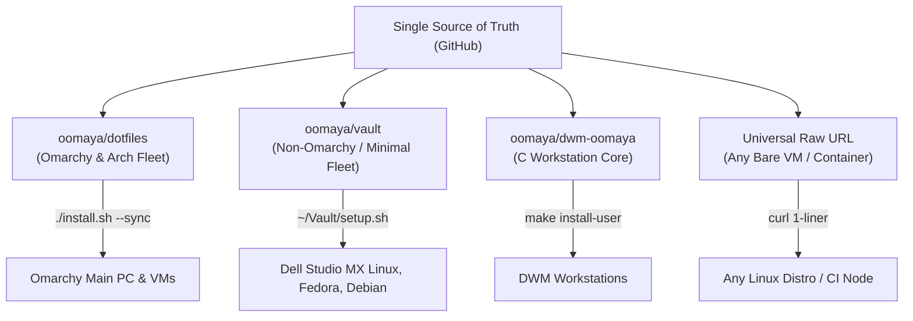

# Systems Craftsmanship: Compressed App & Suite Installation on Linux

A comprehensive engineering guide on installing, structuring, and integrating unpackaged archive downloads—including **JetBrains suites**, **VMware Workstation**, **AppImages**, and standalone developer tools—into the Linux filesystem hierarchy following POSIX and XDG standards.

---

## 1. The Unix Filesystem Standard: `/opt` vs `~/.local`

When downloading `.tar.gz`, `.tar.xz`, `.bundle`, or AppImage packages, never extract them haphazardly into `$HOME/Downloads` or dump entire application trees into `~/.local/bin`.

| Destination | Scope | Permissions | Best Suited For |
| :--- | :--- | :--- | :--- |
| **`/opt/<app-name>`** | System-Wide (All Users) | `root:root` (`755`) | Multi-user developer suites (JetBrains IntelliJ/PyCharm/GoLand, VMware Workstation, Android Studio, Google Chrome). |
| **`~/.local/share/<app-name>`** | User-Local (Single User) | `$USER:$USER` (`755`) | Unprivileged personal installations, tools without `sudo` access, or roaming developer profiles. |
| **`/usr/local/bin`** | Executable Path (System) | `root:root` (`755`) | Single symlinks or trampoline scripts pointing to `/opt/<app-name>/bin/<app>`. |
| **`~/.local/bin`** | Executable Path (User) | `$USER:$USER` (`755`) | Single symlinks or trampoline scripts pointing to `~/.local/share/<app-name>/...`. |

> [!IMPORTANT]
> **Rule of Clean Paths**:
> `PATH` directories (`/usr/local/bin`, `~/.local/bin`) must contain **only executable binaries, symlinks, or trampoline scripts**. Never extract a multi-file suite (with `lib/`, `plugins/`, `assets/`) directly inside `bin/`.

---

## 2. JetBrains Developer Suites (Tarball `.tar.gz`)

### Step-by-Step Installation
```bash
# 1. Choose target product and extract to /opt
APP_NAME="idea-IU" # or pycharm, clion, goland
ARCHIVE="ideaIU-*.tar.gz"

# 2. Extract into /opt
sudo tar -xzf "$ARCHIVE" -C /opt/

# 3. Standardize folder name (symlink or rename versionless for seamless upgrades)
TARGET_DIR=$(find /opt -maxdepth 1 -type d -name "idea-*" | head -n 1)
sudo ln -sfn "$TARGET_DIR" /opt/intellij-idea

# 4. Create executable symlink in /usr/local/bin
sudo ln -sfn /opt/intellij-idea/bin/idea.sh /usr/local/bin/idea
```

### XDG Desktop Entry Integration
Create `/usr/share/applications/intellij-idea.desktop`:
```ini
[Desktop Entry]
Version=1.0
Type=Application
Name=IntelliJ IDEA Ultimate
GenericName=Java / Kotlin IDE
Comment=Capable and Ergonomic IDE for JVM
Exec=/usr/local/bin/idea %u
Icon=/opt/intellij-idea/bin/idea.svg
Terminal=false
Categories=Development;IDE;
StartupNotify=true
StartupWMClass=jetbrains-idea
```
Update application caches:
```bash
sudo update-desktop-database /usr/share/applications
```

---

## 3. VMware Workstation (`.bundle` / `.tar.gz`)

VMware Workstation uses an interactive shell bundle requiring kernel module compilation (`vmmon`, `vmnet`) and systemd service management.

### Installation & Module Compilation
```bash
# 1. Make installer bundle executable
chmod +x VMware-Workstation-*.bundle

# 2. Execute installation with systemd service configuration
sudo ./VMware-Workstation-*.bundle --console --eulas-agreed --required

# 3. Compile kernel modules for current kernel (Fedora / CachyOS / Arch)
sudo vmware-modconfig --console --install-all

# 4. Enable and start core background services
sudo systemctl enable --now vmware.service
sudo systemctl enable --now vmware-USBArbitrator.service
```

### dwm / Tiling Window Manager Protection
VMware spawns internal helper windows (`vmware-user`, `vmtoolsd`) that lack `override_redirect`. Ensure your window manager rules flag them as `unmanaged = 1` to prevent ghost window hijacking:
```c
/* config.def.h */
{ "vmware-user", NULL, NULL, 0, 0, 0, 0, 0, -1, 1 },
{ "vmtoolsd",    NULL, NULL, 0, 0, 0, 0, 0, -1, 1 },
```

---

## 4. AppImage Self-Contained Packages

AppImages package runtimes and dependencies in a mountable squashfs image.

### Recommended Deployment
```bash
# 1. Create dedicated AppImage repository
mkdir -p ~/.local/share/appimages/
mkdir -p ~/.local/bin/

# 2. Move binary and make executable
mv MyApp.AppImage ~/.local/share/appimages/myapp.AppImage
chmod +x ~/.local/share/appimages/myapp.AppImage

# 3. Create trampoline script in ~/.local/bin
cat > ~/.local/bin/myapp <<'EOF'
#!/bin/sh
exec "$HOME/.local/share/appimages/myapp.AppImage" "$@"
EOF
chmod +x ~/.local/bin/myapp
```

### Gear Lever Integration
For automatic desktop integration, icon extraction, and update tracking, use **Gear Lever**:
```bash
# Gear Lever monitors and integrates AppImages into XDG menus automatically
gearlever ~/.local/share/appimages/myapp.AppImage
```

---

## 5. Antigravity IDE Packaging Standard

To install Antigravity IDE cleanly following this runbook:

```bash
# 1. Create target directory
sudo mkdir -p /opt/antigravity-ide

# 2. Move extracted suite
sudo cp -r "$HOME/Downloads/Antigravity IDE/"* /opt/antigravity-ide/
sudo chmod -R 755 /opt/antigravity-ide/

# 3. Create global binary trampoline
sudo ln -sfn /opt/antigravity-ide/antigravity-ide /usr/local/bin/antigravity

# 4. Create desktop entry
sudo cat > /usr/share/applications/antigravity.desktop <<'EOF'
[Desktop Entry]
Version=1.0
Type=Application
Name=Antigravity IDE
GenericName=AI Pair Programming IDE
Comment=Next-generation advanced agentic coding environment
Exec=/usr/local/bin/antigravity %F
Icon=/opt/antigravity-ide/resources/app/resources/linux/code.png
Terminal=false
Categories=Development;IDE;
StartupNotify=true
StartupWMClass=Antigravity IDE
EOF

sudo update-desktop-database /usr/share/applications
```

---

## 6. The Automated 1-Command Solution: `app-install`

To eliminate the manual 5-step checklist friction, we created **`app-install`** (packaged as `dwm-app-install` and stowed across the fleet). It automates the entire installation, binary discovery, icon indexing, PATH linking, and desktop integration lifecycle in under 1 second.

### Supported Package Formats
- Archives: `.tar.gz`, `.tgz`, `.tar.xz`, `.txz`, `.tar.bz2`, `.tbz2`, `.zip`
- Pre-extracted application directories (e.g. `Downloads/Antigravity IDE/`)
- Single standalone executable binaries and AppImages

### Command Syntax & CLI Flags
```text
Usage: app-install [OPTIONS] <ARCHIVE_OR_DIRECTORY>

Options:
  --user               Install for current user only (~/.local/share and ~/.local/bin) [default when unprivileged]
  --system             Install system-wide (/opt and /usr/local/bin; requires sudo) [default when root]
  --name <slug>        Custom command/folder name (e.g. "idea", "antigravity", "postman")
  --title <Title>      Friendly desktop display name (e.g. "IntelliJ IDEA", "Antigravity IDE")
  --exec <relpath>     Explicit relative path to main executable inside the package
  --icon <relpath>     Explicit relative path to icon inside package (.svg or .png)
  --category <cats>    XDG Categories (default: "Development;Utility;")
  -h, --help           Show help documentation
```

### Real-World Usage Examples
```bash
# 1. JetBrains Suite (User-local, no sudo required):
app-install --user ~/Downloads/ideaIU-2024.1.tar.gz

# 2. Extracted Developer Environment (Custom slug & title):
app-install --user "$HOME/Downloads/Antigravity IDE" --name antigravity --title "Antigravity IDE"

# 3. System-Wide Multi-User Utility (/opt and /usr/local/bin):
sudo app-install ~/Downloads/postman-linux-x64.tar.gz

# 4. Explicit Binary Override (when package contains multiple scripts):
app-install --user ~/Downloads/android-studio-2024.1.tar.gz --exec "bin/studio.sh" --name android-studio
```

### What `app-install` Automates Under the Hood:
1. **Archive Extraction**: Unpacks `.tar.gz`, `.tar.xz`, `.zip`, or directory trees cleanly into `/opt/<name>` (system) or `~/.local/share/<name>` (user).
2. **Binary Auto-Detection**: Scans `bin/` and package roots for main ELF executables or startup scripts matching the slug.
3. **Icon Auto-Discovery**: Finds the highest-resolution `.svg` or `.png` application logo inside the package.
4. **PATH Trampoline**: Creates an immediate symlink in `/usr/local/bin/<name>` or `~/.local/bin/<name>`.
5. **XDG Desktop Entry Generation**: Generates a compliant `.desktop` specification with `Name`, `Exec`, `Icon`, and `StartupWMClass`.
6. **Desktop Index Refresh**: Triggers `update-desktop-database` so application launchers detect the new tool immediately without restarting the window manager.

---

## 7. Cross-Machine Fleet Deployment (Methods 1 to 4)

To ensure `app-install` is universally available across all physical rigs, VMs, and minimal servers without manual copying, use one of the following automated pipelines:



### Method 1: The Universal 1-Liner Curl (Fastest for Any VM / Bare Distro)
Requires zero git clones, build toolchains, or window managers. Works out of the box on Ubuntu, Debian, Fedora, Arch, Alpine, or temporary cloud instances:

```bash
# User-local install (~/.local/bin/app-install):
curl -fsSL https://raw.githubusercontent.com/oomaya/dotfiles/master/omarchy/.local/bin/app-install -o ~/.local/bin/app-install && chmod +x ~/.local/bin/app-install

# Or system-wide install (/usr/local/bin/app-install):
sudo curl -fsSL https://raw.githubusercontent.com/oomaya/dotfiles/master/omarchy/.local/bin/app-install -o /usr/local/bin/app-install && sudo chmod +x /usr/local/bin/app-install
```

### Method 2: Omarchy Fleet via GNU Stow Pipeline (`oomaya/dotfiles`)
On any Omarchy or Arch-based workstation (Main Rig, Omarchy VMware VM, LG Gram), `app-install` is tracked inside the `omarchy` package:

```bash
cd ~/dotfiles  # or ~/.dotfiles
./install.sh --sync
```
- **Automated Stowing**: Links `~/dotfiles/omarchy/.local/bin/app-install` $\rightarrow$ `~/.local/bin/app-install` (and alias `dwm-app-install`).
- **Health Suite Verification**: Stage 4 automatically runs `./verify.sh`, which confirms `app-install` is present and executable in `$PATH`.

### Method 3: Non-Omarchy Fleet via Vault Bootstrap (`oomaya/vault`)
For minimal hardware, non-Wayland nodes, and secondary laptops (e.g. Dell Studio 1558 on MX Linux, Fedora, Debian):

```bash
# 1. Clone your vault repository
git clone git@github.com:oomaya/vault.git ~/Vault

# 2. Run the self-contained setup script
~/Vault/setup.sh
```
Section 5.5 of `setup.sh` automatically fetches `app-install` and wires it to `~/.local/bin/app-install` alongside the knowledge vault tools (`art`, `antigravity-sync-artifacts`).

### Method 4: Workstations Running `dwm-oomaya`
If you are developing or running the `dwm-oomaya` suckless desktop:

```bash
cd ~/dwm-oomaya
git pull
make install-user       # Installs ~/.local/bin/app-install and ~/.local/bin/dwm-app-install
# Or for system-wide:
sudo make install-system
```

---

## 8. Application Lifecycle & Maintenance Runbook

### Upgrading Applications
To update an application to a newer release:
1. Download the new archive release (e.g. `ideaIU-2024.2.tar.gz`).
2. Run `app-install` using the same `--name` or letting the slug auto-match:
   ```bash
   app-install --user ~/Downloads/ideaIU-2024.2.tar.gz --name idea
   ```
3. `app-install` replaces the existing extracted folder in `~/.local/share/idea` atomically, updates the executable pointer, and refreshes the desktop database without breaking existing configuration or project files.

### Clean Uninstallation
To completely remove an application installed via `app-install`:

```bash
# 1. Define the application slug
APP="idea"

# For User-Local installs:
rm -rf "$HOME/.local/share/$APP" "$HOME/.local/bin/$APP" "$HOME/.local/share/applications/$APP.desktop"
update-desktop-database "$HOME/.local/share/applications" 2>/dev/null || true

# For System-Wide installs:
sudo rm -rf "/opt/$APP" "/usr/local/bin/$APP" "/usr/share/applications/$APP.desktop"
sudo update-desktop-database /usr/share/applications 2>/dev/null || true
```

### Desktop Launcher Compatibility
Because `app-install` strictly adheres to the XDG Desktop Entry Specification and updates the system desktop cache, newly installed applications appear instantaneously in:
- **`dmenu-desktop`** (`Super + D` in `dwm-oomaya`)
- **`omarchy-menu-apps`** / **`fuzzel`** (`Super + Space` in Omarchy / Hyprland)
- **`walker`**, **`rofi`**, **`wofi`**
- **GNOME Shell**, **KDE Plasma**, and **XFCE Application Finder**

---

## 9. Summary Checklist

- [ ] Extracted cleanly to `/opt/<app>` (system) or `~/.local/share/<app>` (user).
- [ ] Single symlink / trampoline created in `/usr/local/bin` or `~/.local/bin`.
- [ ] `.desktop` file created with valid `Exec`, `Icon`, `Categories`, and `StartupWMClass`.
- [ ] `update-desktop-database` executed to refresh application index.
- [ ] Verified launching via terminal command and desktop launcher (`dmenu-desktop`, `fuzzel`).

*(All 5 steps above are automated in under 1 second via `app-install`)*
